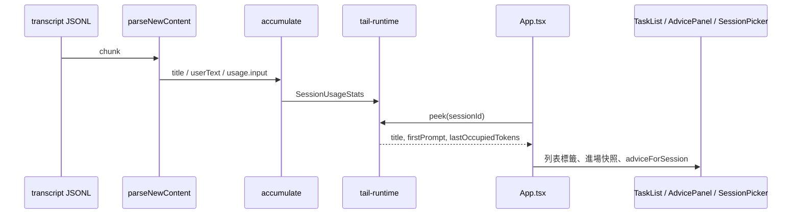

# Session 識別、當下建議、進場 context 快照 Implementation Plan

> **For agentic workers:** REQUIRED SUB-SKILL: Use superpowers:subagent-driven-development (recommended) or superpowers:executing-plans to implement this plan task-by-task. Steps use checkbox (`- [ ]`) syntax for tracking.

**Goal:** `watch` 的 session 列改成短 ID + 標題 + 活動 + 相對時間；按 `a` 只看目前選中 session 的用量建議；同一個 watch 行程裡每個 session 第一次進去時顯示凍結的 context 占用快照。

**Architecture:** transcript 解析多認 `ai-title`、可用的 user prompt、`input_tokens`；`accumulate` 把 `title` / `firstPrompt` / `lastOccupiedTokens` 寫進記憶體中的 `SessionUsageStats`；`peek(sessionId)` 給列表與進場快照讀，不再重讀檔。建議過濾與進場是否顯示都是純函式；App 只負責選中態、notice 條件、以及一個行程內的 `Set`。

**Tech Stack:** TypeScript、Node `node:test` + `node:assert/strict`、Ink（既有）。無新依賴。

**Spec:** `docs/superpowers/specs/2026-09-15-session-identity-context-design.md`



## Global Constraints

- 不改 hook、不把標題寫進 `~/.claude-task-tracker/<id>.json`、不改狀態檔 schema。
- 不新增 `AdviceKind`、不改既有 detector 門檻。
- 不在 session 列表上顯示占用 %。
- 不做 Claude Code `/context` 的 System / Skills / Messages 分類拆帳。
- 不更新 README「升到 vX.Y.Z 後要再執行一次」那行。
- App.tsx 本身不測（跟現況一樣）；行為抽純函式，TDD 先寫失敗測試。
- 新功能：`package.json` `0.10.0` → `0.11.0`，README「目前版本」同步。
- token 數字與建議面板一樣用 `.toLocaleString("en-US")`。
- 執行時若在 isolated worktree，用 `superpowers:using-git-worktrees` 建立；本 plan 不預先建 worktree。

## File structure

| 路徑 | 職責 |
|------|------|
| Create: `src/format-relative-age.ts` | 從 AdvicePanel 抽出的相對時間純函式 |
| Create: `src/format-relative-age.test.ts` | 剛剛 / 分鐘 / 小時 / 天 |
| Create: `src/context-snapshot.ts` | `shouldShowContextSnapshot`、占用文案、活動+任務行 |
| Create: `src/context-snapshot.test.ts` | 快照文案與第二次不顯示 |
| Modify: `src/usage/types.ts` | `ParsedUsage.input`；`ParsedEvent.title?` / `userText?`；`SessionUsageStats` 三個新欄 |
| Modify: `src/usage/tail-transcript.ts` | 認 `ai-title`、可用 user 文字、`input_tokens` |
| Modify: `src/usage/tail-transcript.test.ts` | 對應解析行為 |
| Modify: `src/usage/accumulate.ts` | 第一次寫 title / firstPrompt；去重後覆寫 `lastOccupiedTokens` |
| Modify: `src/usage/accumulate.test.ts` | 對應累積行為；既有 fixture 補 `input` |
| Modify: `src/usage/detect.test.ts` | fixture 補 `input: 0`（型別變了，行為不變） |
| Modify: `src/usage/tail-runtime.ts` | `peek(sessionId)` |
| Modify: `src/usage/tail-runtime.test.ts` | prime 後 peek 得到 title 與占用 |
| Modify: `src/usage/advice-groups.ts` | `adviceForSession` 取代 `groupAdviceByProject` |
| Modify: `src/usage/advice-groups.test.ts` | 改測 `adviceForSession` |
| Modify: `src/usage/pipeline.test.ts` | 接 `adviceForSession` |
| Modify: `src/session-preference.ts` | 短 ID + 標題 + 活動 + 相對時間 |
| Modify: `src/session-preference.test.ts` | 標籤規則 |
| Modify: `src/ui/AdvicePanel.tsx` | 單 session 排版與未選空態 |
| Modify: `src/ui/TaskList.tsx` | 第一次進入時渲染快照 |
| Modify: `src/ui/App.tsx` | 過濾建議、notice、進場 Set、`peek` |
| Modify: `package.json` | `version` `0.11.0` |
| Modify: `README.md` | `目前版本` **v0.11.0** |

不改：`src/hook/**`、`src/schema.ts`、`src/usage/detect.ts`。

---

### Task 1: 抽出 `formatRelativeAge`

**Files:**
- Create: `src/format-relative-age.ts`
- Create: `src/format-relative-age.test.ts`
- Modify: `src/ui/AdvicePanel.tsx`（改 import，函式本體刪掉）

**Interfaces:**
- Consumes: 無
- Produces: `formatRelativeAge(at: string, now?: number): string`（`now` 預設 `Date.now()`）

- [ ] **Step 1: Write the failing test**

Create `src/format-relative-age.test.ts`:

```ts
import assert from "node:assert/strict";
import test from "node:test";
import { formatRelativeAge } from "./format-relative-age.js";

const NOW = Date.parse("2026-09-15T12:00:00.000Z");

test("formatRelativeAge 未滿 1 分鐘顯示剛剛", () => {
  assert.equal(formatRelativeAge("2026-09-15T11:59:30.000Z", NOW), "剛剛");
});

test("formatRelativeAge 未滿 60 分鐘顯示 N 分鐘前", () => {
  assert.equal(formatRelativeAge("2026-09-15T11:57:00.000Z", NOW), "3 分鐘前");
});

test("formatRelativeAge 滿 60 分鐘改顯示 N 小時前", () => {
  assert.equal(formatRelativeAge("2026-09-15T11:00:00.000Z", NOW), "1 小時前");
});

test("formatRelativeAge 滿 24 小時改顯示 N 天前", () => {
  assert.equal(formatRelativeAge("2026-09-14T12:00:00.000Z", NOW), "1 天前");
});

test("formatRelativeAge 無效時間回空字串", () => {
  assert.equal(formatRelativeAge("not-a-date", NOW), "");
});
```

- [ ] **Step 2: Run test to verify it fails**

Run: `node --import tsx --test src/format-relative-age.test.ts`

Expected: FAIL — `Cannot find module` `./format-relative-age.js`

- [ ] **Step 3: Write minimal implementation**

Create `src/format-relative-age.ts`（從 `src/ui/AdvicePanel.tsx` 的 `formatRelativeAge` 原樣搬出，語意不得改）：

```ts
export function formatRelativeAge(at: string, now: number = Date.now()): string {
  const ts = new Date(at).getTime();
  if (!Number.isFinite(ts)) return "";
  const diffMinutes = Math.floor(Math.max(0, now - ts) / 60000);
  if (diffMinutes < 1) return "剛剛";
  if (diffMinutes < 60) return `${diffMinutes} 分鐘前`;
  const diffHours = Math.floor(diffMinutes / 60);
  if (diffHours < 24) return `${diffHours} 小時前`;
  const diffDays = Math.floor(diffHours / 24);
  return `${diffDays} 天前`;
}
```

在 `src/ui/AdvicePanel.tsx`：刪掉本機 `formatRelativeAge`，改成

```ts
import { formatRelativeAge } from "../format-relative-age.js";
```

呼叫處 `formatRelativeAge(row.at)` 不變。

- [ ] **Step 4: Run the tests and make sure they pass**

Run: `node --import tsx --test src/format-relative-age.test.ts src/usage/advice-groups.test.ts`

Expected: PASS（advice-groups 只是確認沒誤改建議分組）

- [ ] **Step 5: Commit**

```bash
git add src/format-relative-age.ts src/format-relative-age.test.ts src/ui/AdvicePanel.tsx
git commit -m "$(cat <<'EOF'
refactor: extract formatRelativeAge for session labels and advice

EOF
)"
```

---

### Task 2: transcript 解析 title / firstPrompt / input_tokens

**Files:**
- Modify: `src/usage/types.ts`
- Modify: `src/usage/tail-transcript.ts`
- Modify: `src/usage/tail-transcript.test.ts`
- Modify: `src/usage/accumulate.test.ts`（fixture 補 `input: 0`，行為斷言先不動）
- Modify: `src/usage/detect.test.ts`（fixture 補 `input: 0`）

**Interfaces:**
- Consumes: 既有 `parseNewContent(chunk, state, bytesRead)`、`ParsedEvent`、`ParsedUsage`
- Produces:
  - `ParsedUsage.input: number`（讀 `input_tokens`，缺就 0）
  - `ParsedEvent.title?: string`
  - `ParsedEvent.userText?: string`
  - `SessionUsageStats.title?: string`
  - `SessionUsageStats.firstPrompt?: string`
  - `SessionUsageStats.lastOccupiedTokens?: number`
  - `parseNewContent` 對無 `message` 的 `ai-title` 行不再 `continue` 丟掉

- [ ] **Step 1: Write the failing tests**

在 `src/usage/tail-transcript.test.ts` 既有測試之後追加。`assistantLine` helper 的 `usage` 物件加上可選 `input?: number`，寫入 `input_tokens: opts.input ?? 0`（既有測試不傳就還是 0）。

```ts
function aiTitleLine(aiTitle: string): string {
  return JSON.stringify({ type: "ai-title", aiTitle, timestamp: "2026-09-15T00:00:00.000Z" });
}

function userTextLine(content: unknown, opts?: { isSidechain?: boolean }): string {
  return JSON.stringify({
    isSidechain: opts?.isSidechain ?? false,
    timestamp: "2026-09-15T00:00:00.000Z",
    message: { role: "user", content },
  });
}

test("parseNewContent 讀 type=ai-title 的 aiTitle，即使沒有 message 也不丟", () => {
  const chunk = aiTitleLine("修用量面板") + "\n";
  const { events } = parseNewContent(chunk, createTailState(), Buffer.byteLength(chunk, "utf-8"));
  assert.equal(events.length, 1);
  assert.equal(events[0].title, "修用量面板");
  assert.equal(events[0].usage, undefined);
});

test("parseNewContent 空的 aiTitle 不產生事件", () => {
  const chunk = aiTitleLine("   ") + "\n";
  const { events } = parseNewContent(chunk, createTailState(), Buffer.byteLength(chunk, "utf-8"));
  assert.equal(events.length, 0);
});

test("parseNewContent 主線 user 字串當成 firstPrompt 候選", () => {
  const chunk = userTextLine("幫我修用量面板") + "\n";
  const { events } = parseNewContent(chunk, createTailState(), Buffer.byteLength(chunk, "utf-8"));
  assert.equal(events[0].userText, "幫我修用量面板");
});

test("parseNewContent 串起 array 裡 type=text 的文字", () => {
  const chunk = userTextLine([
    { type: "text", text: "第一段" },
    { type: "text", text: "第二段" },
  ]) + "\n";
  const { events } = parseNewContent(chunk, createTailState(), Buffer.byteLength(chunk, "utf-8"));
  assert.equal(events[0].userText, "第一段第二段");
});

test("parseNewContent 略過只有 tool_result、沒有 text 的 user 行（不當 userText）", () => {
  const chunk = userTextLine([{ type: "tool_result", tool_use_id: "t1", content: "x" }]) + "\n";
  const { events } = parseNewContent(chunk, createTailState(), Buffer.byteLength(chunk, "utf-8"));
  assert.equal(events.every((event) => event.userText === undefined), true);
  assert.equal(events.some((event) => event.toolResultChars), true);
});

test("parseNewContent 略過 <local-command-caveat> 開頭的 user 文字", () => {
  const chunk = userTextLine("<local-command-caveat>\n/compact") + "\n";
  const { events } = parseNewContent(chunk, createTailState(), Buffer.byteLength(chunk, "utf-8"));
  assert.equal(events.length, 0);
});

test("parseNewContent 略過 trim 後空的 user 文字", () => {
  const chunk = userTextLine("   ") + "\n";
  const { events } = parseNewContent(chunk, createTailState(), Buffer.byteLength(chunk, "utf-8"));
  assert.equal(events.length, 0);
});

test("parseNewContent 把 input_tokens 寫進 usage.input", () => {
  const chunk = assistantLine({ id: "m1", cacheCreation: 100, input: 500 }) + "\n";
  const { events } = parseNewContent(chunk, createTailState(), Buffer.byteLength(chunk, "utf-8"));
  assert.equal(events[0].usage?.input, 500);
});

test("parseNewContent 缺少 input_tokens 時 usage.input 為 0", () => {
  const chunk = assistantLine({ id: "m1", cacheCreation: 100 }) + "\n";
  const { events } = parseNewContent(chunk, createTailState(), Buffer.byteLength(chunk, "utf-8"));
  assert.equal(events[0].usage?.input, 0);
});
```

`assistantLine` 的 `opts` 加上 `input?: number`，`usage` 寫成：

```ts
      usage: {
        cache_creation_input_tokens: opts.cacheCreation,
        cache_read_input_tokens: opts.cacheRead ?? 0,
        output_tokens: opts.output ?? 0,
        input_tokens: opts.input ?? 0,
      },
```

既有 `assistantLine({ id, cacheCreation })` 呼叫不用改。

- [ ] **Step 2: Run test to verify it fails**

Run: `node --import tsx --test src/usage/tail-transcript.test.ts`

Expected: FAIL — 新測試拿不到 `title` / `userText` / `usage.input`（`ai-title` 行現在在 `if (!isRecord(message)) continue` 被丟）。

- [ ] **Step 3: Write minimal implementation**

`src/usage/types.ts` 的 `ParsedUsage` 加上 `input: number`：

```ts
export interface ParsedUsage {
  cacheCreation: number;
  cacheRead: number;
  output: number;
  input: number;
}
```

`ParsedEvent` 加上兩個可選欄：

```ts
export interface ParsedEvent {
  messageId: string | undefined;
  isSidechain: boolean;
  timestamp: string | undefined;
  usage: ParsedUsage | undefined;
  toolResultChars: ToolResultChars | undefined;
  title?: string;
  userText?: string;
}
```

`SessionUsageStats` 加上：

```ts
  title?: string;
  firstPrompt?: string;
  lastOccupiedTokens?: number;
```

`createSessionUsageStats` 不必填這三個（省略即 `undefined`）。

`src/usage/tail-transcript.ts`：在 `isRecord(parsed)` 之後、讀 `message` 之前處理 `ai-title`；assistant usage 加上 `input`；user 行抽出可用文字。在 `isRecord` helper 附近新增：

```ts
function extractUsableUserText(content: unknown): string | undefined {
  let raw: string | undefined;
  if (typeof content === "string") {
    raw = content;
  } else if (Array.isArray(content)) {
    const parts: string[] = [];
    for (const block of content) {
      if (!isRecord(block) || block.type !== "text") continue;
      if (typeof block.text === "string") parts.push(block.text);
    }
    if (parts.length === 0) return undefined;
    raw = parts.join("");
  } else {
    return undefined;
  }
  const trimmed = raw.trim();
  if (!trimmed) return undefined;
  if (trimmed.startsWith("<local-command-caveat>")) return undefined;
  return trimmed;
}

function identityEvent(
  isSidechain: boolean,
  timestamp: string | undefined,
  extra: { title?: string; userText?: string },
): ParsedEvent {
  return {
    messageId: undefined,
    isSidechain,
    timestamp,
    usage: undefined,
    toolResultChars: undefined,
    ...extra,
  };
}
```

`parseNewContent` 迴圈內，`const timestamp = ...` 之後改成：

```ts
    if (parsed.type === "ai-title") {
      const aiTitle = typeof parsed.aiTitle === "string" ? parsed.aiTitle.trim() : "";
      if (aiTitle) events.push(identityEvent(isSidechain, timestamp, { title: aiTitle }));
      continue;
    }

    const message = parsed.message;
    if (!isRecord(message)) continue;
```

assistant usage 物件加上 `input: numberOr0(usage.input_tokens)`。

user 處理改成（保留既有 tool_result 迴圈）：

```ts
    if (role === "user") {
      const userText = extractUsableUserText(content);
      if (userText) events.push(identityEvent(isSidechain, timestamp, { userText }));
      if (Array.isArray(content)) {
        for (const block of content) {
          if (!isRecord(block) || block.type !== "tool_result") continue;
          // 既有 tool_result 事件 push，原樣
        }
      }
    }
```

把 `accumulate.test.ts` / `detect.test.ts` 所有 `{ cacheCreation, cacheRead, output }` 字面值補上 `input: 0`（沒有 `input` 會 typecheck 失敗）。不要改那些測試的斷言。

- [ ] **Step 4: Run the tests and make sure they pass**

Run: `node --import tsx --test src/usage/tail-transcript.test.ts src/usage/accumulate.test.ts src/usage/detect.test.ts`

Expected: PASS

- [ ] **Step 5: Commit**

```bash
git add src/usage/types.ts src/usage/tail-transcript.ts src/usage/tail-transcript.test.ts src/usage/accumulate.test.ts src/usage/detect.test.ts
git commit -m "$(cat <<'EOF'
feat: parse ai-title, first user prompt, and input tokens from transcripts

EOF
)"
```

---

### Task 3: accumulate 寫入 title / firstPrompt / lastOccupiedTokens

**Files:**
- Modify: `src/usage/accumulate.ts`
- Modify: `src/usage/accumulate.test.ts`

**Interfaces:**
- Consumes: Task 2 的 `ParsedEvent.title` / `userText` / `usage.input`
- Produces: `accumulate` 對 `SessionUsageStats` 寫入：
  - `title`：第一個非 sidechain 過濾後仍看到的 `event.title`（`ai-title` 在 parser 已發出；accumulate 在 `isSidechain` skip **之前**寫 title，避免漏掉）
  - `firstPrompt`：第一個主線 `event.userText`
  - `lastOccupiedTokens`：每次採計一則去重後的主線 usage 時覆寫為 `input + cacheRead + cacheCreation`

- [ ] **Step 1: Write the failing tests**

在 `src/usage/accumulate.test.ts` 追加。`usageEvent` helper 的 `usage` 已經有 `input`（Task 2 補的）。再加一個 identity helper：

```ts
function titleEvent(title: string, isSidechain = false): ParsedEvent {
  return {
    messageId: undefined,
    isSidechain,
    timestamp: "2026-09-15T00:00:00.000Z",
    usage: undefined,
    toolResultChars: undefined,
    title,
  };
}

function userTextEvent(userText: string, isSidechain = false): ParsedEvent {
  return {
    messageId: undefined,
    isSidechain,
    timestamp: "2026-09-15T00:00:00.000Z",
    usage: undefined,
    toolResultChars: undefined,
    userText,
  };
}

test("accumulate 只記第一次 title 與 firstPrompt", () => {
  const stats0 = createSessionUsageStats("s1");
  const first = accumulate(stats0, [titleEvent("修用量面板"), userTextEvent("幫我修")]);
  assert.equal(first.next.title, "修用量面板");
  assert.equal(first.next.firstPrompt, "幫我修");
  const second = accumulate(first.next, [titleEvent("另一個標題"), userTextEvent("另一句")]);
  assert.equal(second.next.title, "修用量面板");
  assert.equal(second.next.firstPrompt, "幫我修");
});

test("accumulate 忽略 sidechain 的 userText，但 sidechain 的 title 仍取第一次", () => {
  const stats0 = createSessionUsageStats("s1");
  const { next } = accumulate(stats0, [
    titleEvent("子代理標題", true),
    userTextEvent("子代理 prompt", true),
    userTextEvent("主線 prompt"),
  ]);
  assert.equal(next.title, "子代理標題");
  assert.equal(next.firstPrompt, "主線 prompt");
});

test("accumulate lastOccupiedTokens 是 input + cacheRead + cacheCreation，隨最新一則去重後主線 usage 覆寫", () => {
  const stats0 = createSessionUsageStats("s1");
  const first = accumulate(stats0, [
    usageEvent({ messageId: "m1", usage: { cacheCreation: 100, cacheRead: 20, output: 9, input: 5 } }),
  ]);
  assert.equal(first.next.lastOccupiedTokens, 125);
  const second = accumulate(first.next, [
    usageEvent({ messageId: "m1", usage: { cacheCreation: 999, cacheRead: 999, output: 9, input: 999 } }),
    usageEvent({ messageId: "m2", usage: { cacheCreation: 10, cacheRead: 200, output: 1, input: 50 } }),
  ]);
  assert.equal(second.next.lastOccupiedTokens, 260);
});

test("accumulate 沒有主線 usage 時 lastOccupiedTokens 仍是 undefined", () => {
  const stats0 = createSessionUsageStats("s1");
  const { next } = accumulate(stats0, [userTextEvent("只有 prompt")]);
  assert.equal(next.lastOccupiedTokens, undefined);
});
```

- [ ] **Step 2: Run test to verify it fails**

Run: `node --import tsx --test src/usage/accumulate.test.ts`

Expected: FAIL — `next.title` / `firstPrompt` / `lastOccupiedTokens` 為 `undefined`

- [ ] **Step 3: Write minimal implementation**

改 `src/usage/accumulate.ts` 的迴圈，title 在 sidechain skip 之前，其餘在之後：

```ts
  for (const event of events) {
    if (event.title !== undefined && stats.title === undefined) {
      stats = { ...stats, title: event.title };
    }
    if (event.isSidechain) continue;

    if (event.userText !== undefined && stats.firstPrompt === undefined) {
      stats = { ...stats, firstPrompt: event.userText };
    }

    if (event.toolResultChars) {
      steps.push({ event, statsBefore: stats, statsAfter: stats });
      continue;
    }

    if (!event.usage) continue;
    if (event.messageId && stats.recentMessageIds.includes(event.messageId)) continue;

    const statsBefore = stats;
    const recentMessageIds = event.messageId
      ? [...stats.recentMessageIds, event.messageId].slice(-RECENT_MESSAGE_ID_LIMIT)
      : stats.recentMessageIds;
    const mainThreadMsgCount = stats.mainThreadMsgCount + 1;
    const cacheCreationTotal = stats.cacheCreationTotal + event.usage.cacheCreation;

    stats = {
      ...stats,
      mainThreadMsgCount,
      sessionStartedAt: stats.sessionStartedAt ?? event.timestamp,
      lastMsgAt: event.timestamp ?? stats.lastMsgAt,
      cacheCreationTotal,
      cacheCreationRollingAvg: cacheCreationTotal / mainThreadMsgCount,
      recentMessageIds,
      lastOccupiedTokens: event.usage.input + event.usage.cacheRead + event.usage.cacheCreation,
    };

    steps.push({ event, statsBefore, statsAfter: stats });
  }
```

title / userText 事件沒有 usage、沒有 toolResultChars：寫完識別欄位後會走到 `if (!event.usage) continue`，不進 `steps`，detector 不受影響。

- [ ] **Step 4: Run the tests and make sure they pass**

Run: `node --import tsx --test src/usage/accumulate.test.ts src/usage/detect.test.ts`

Expected: PASS（detect 仍只看 usage / tool_result steps）

- [ ] **Step 5: Commit**

```bash
git add src/usage/accumulate.ts src/usage/accumulate.test.ts
git commit -m "$(cat <<'EOF'
feat: accumulate session title, first prompt, and occupied tokens

EOF
)"
```

---

### Task 4: `peek(sessionId)`

**Files:**
- Modify: `src/usage/tail-runtime.ts`
- Modify: `src/usage/tail-runtime.test.ts`

**Interfaces:**
- Consumes: Task 3 寫入的 `SessionUsageStats`
- Produces: `peek(sessionId: string): SessionUsageStats | undefined`（沒 prime 過或 `forget` 後為 `undefined`）

- [ ] **Step 1: Write the failing test**

把 `src/usage/tail-runtime.test.ts` 頂部 import 改成：

```ts
import { forget, peek, prime, refresh } from "./tail-runtime.js";
```

在檔案末尾追加 helper 與測試：

```ts
function aiTitleLine(aiTitle: string): string {
  return JSON.stringify({ type: "ai-title", aiTitle });
}

function userLine(text: string): string {
  return JSON.stringify({
    isSidechain: false,
    timestamp: new Date().toISOString(),
    message: { role: "user", content: text },
  });
}

function occupiedAssistantLine(id: string, input: number, cacheCreation: number, cacheRead: number): string {
  return JSON.stringify({
    isSidechain: false,
    timestamp: new Date().toISOString(),
    message: {
      role: "assistant",
      id,
      usage: {
        cache_creation_input_tokens: cacheCreation,
        cache_read_input_tokens: cacheRead,
        output_tokens: 0,
        input_tokens: input,
      },
      content: [{ type: "text", text: "hi" }],
    },
  });
}

test("prime 後 peek 拿得到 title、firstPrompt、lastOccupiedTokens", () => {
  const dir = mkdtempSync(join(tmpdir(), "usage-advisor-"));
  const path = join(dir, "session.jsonl");
  const sessionId = `test-${Date.now()}-peek`;
  try {
    writeFileSync(
      path,
      aiTitleLine("修用量面板") +
        "\n" +
        userLine("幫我修") +
        "\n" +
        occupiedAssistantLine("m0", 50, 100, 20) +
        "\n",
    );
    prime(sessionId, path);
    const stats = peek(sessionId);
    assert.equal(stats?.title, "修用量面板");
    assert.equal(stats?.firstPrompt, "幫我修");
    assert.equal(stats?.lastOccupiedTokens, 170);
  } finally {
    forget(sessionId);
    rmSync(dir, { recursive: true, force: true });
  }
});

test("peek 對沒 prime 過的 session 回 undefined", () => {
  assert.equal(peek("never-primed-session"), undefined);
});
```

- [ ] **Step 2: Run test to verify it fails**

Run: `node --import tsx --test src/usage/tail-runtime.test.ts`

Expected: FAIL — `peek` is not exported / is not a function

- [ ] **Step 3: Write minimal implementation**

在 `src/usage/tail-runtime.ts` 的 `forget` 旁邊加：

```ts
export function peek(sessionId: string): SessionUsageStats | undefined {
  return sessions.get(sessionId)?.stats;
}
```

- [ ] **Step 4: Run the tests and make sure they pass**

Run: `node --import tsx --test src/usage/tail-runtime.test.ts`

Expected: PASS

- [ ] **Step 5: Commit**

```bash
git add src/usage/tail-runtime.ts src/usage/tail-runtime.test.ts
git commit -m "$(cat <<'EOF'
feat: peek in-memory session usage stats for watch UI

EOF
)"
```

---

### Task 5: `adviceForSession` 取代 `groupAdviceByProject`

**Files:**
- Modify: `src/usage/advice-groups.ts`
- Modify: `src/usage/advice-groups.test.ts`
- Modify: `src/usage/pipeline.test.ts`

**Interfaces:**
- Consumes: `Advice`
- Produces: `adviceForSession(advice: readonly Advice[], sessionId: string | undefined): Advice[]`
  - `sessionId === undefined` → `[]`
  - 否則只留該 id，依 `at` 新到舊排序（與舊 `groupAdviceByProject` 同一 session 內排序相同）
- 本 task **只新增** `adviceForSession` 並改測試。`groupAdviceByProject` 暫時留著給 `App.tsx` 編譯；Task 8 改完 UI 後再刪（那時才沒有呼叫端）。

- [ ] **Step 1: Write the failing tests**

把 `src/usage/advice-groups.test.ts` **整份換成**：

```ts
import assert from "node:assert/strict";
import test from "node:test";
import { Advice } from "./types.js";
import { adviceForSession } from "./advice-groups.js";

const advice: Advice[] = [
  { sessionId: "session-aaa11111", kind: "long-session", at: "2026-09-15T01:00:00.000Z", message: "old" },
  { sessionId: "session-bbb22222", kind: "cache-spike", at: "2026-09-15T02:00:00.000Z", message: "other" },
  { sessionId: "session-aaa11111", kind: "cache-spike", at: "2026-09-15T01:05:00.000Z", message: "new" },
];

test("adviceForSession 只留 selected session，依時間新到舊", () => {
  const filtered = adviceForSession(advice, "session-aaa11111");
  assert.deepEqual(
    filtered.map((item) => item.message),
    ["new", "old"],
  );
});

test("adviceForSession 在 sessionId 為 undefined 時回空陣列", () => {
  assert.deepEqual(adviceForSession(advice, undefined), []);
});

test("adviceForSession 沒有該 session 的建議時回空陣列", () => {
  assert.deepEqual(adviceForSession(advice, "missing"), []);
});
```

把 `src/usage/pipeline.test.ts` 的 `groupAdviceByProject` 段換成 `adviceForSession`：

```ts
import { forget, prime } from "./tail-runtime.js";
import { adviceForSession } from "./advice-groups.js";
```

刪掉 `SessionHint` import 與 `hint` / `groups` 組裝。測試本體改成：

```ts
test("prime() 產生的 advice 接上 adviceForSession，只留下該 session", () => {
  // dir / path / sessionId / writeFileSync / prime 與現況相同
    const filtered = adviceForSession(primed.advice, sessionId);
    assert.equal(filtered.length, primed.advice.length);
    assert.equal(filtered.every((item) => item.sessionId === sessionId), true);
    assert.equal(filtered.some((item) => item.kind === "heavy-baseline"), true);
    assert.deepEqual(adviceForSession(primed.advice, undefined), []);
  // finally 不變
});
```

- [ ] **Step 2: Run test to verify it fails**

Run: `node --import tsx --test src/usage/advice-groups.test.ts src/usage/pipeline.test.ts`

Expected: FAIL — `adviceForSession` is not exported

- [ ] **Step 3: Write minimal implementation**

在 `src/usage/advice-groups.ts` **頂部**（既有 import 之後）加上，不要刪 `groupAdviceByProject`：

```ts
export function adviceForSession(advice: readonly Advice[], sessionId: string | undefined): Advice[] {
  if (sessionId === undefined) return [];
  return advice
    .filter((item) => item.sessionId === sessionId)
    .sort((left, right) => right.at.localeCompare(left.at));
}
```

- [ ] **Step 4: Run the tests and make sure they pass**

Run: `node --import tsx --test src/usage/advice-groups.test.ts src/usage/pipeline.test.ts`

Expected: PASS

- [ ] **Step 5: Commit**

```bash
git add src/usage/advice-groups.ts src/usage/advice-groups.test.ts src/usage/pipeline.test.ts
git commit -m "$(cat <<'EOF'
feat: filter usage advice to the selected session

EOF
)"
```

---

### Task 6: context 快照純函式

**Files:**
- Create: `src/context-snapshot.ts`
- Create: `src/context-snapshot.test.ts`

**Interfaces:**
- Consumes: `Activity`（`src/schema.ts`）
- Produces:
  - `CONTEXT_WINDOW_TOKENS = 1_000_000`
  - `shouldShowContextSnapshot(shownSessionIds: ReadonlySet<string>, sessionId: string): boolean`
  - `formatOccupiedTokensLine(lastOccupiedTokens: number | undefined): string`
  - `activityLineLabel(activity: Activity): string`（與 TaskList `ActivityLine` 的句首規則相同：running 前置 `◐`，否則 summary 或「已使用 …」；**不含**時間）
  - `formatSnapshotActivityLine(input: { activity?: Activity; done: number; total: number }): string | undefined`

- [ ] **Step 1: Write the failing test**

Create `src/context-snapshot.test.ts`:

```ts
import assert from "node:assert/strict";
import test from "node:test";
import {
  activityLineLabel,
  formatOccupiedTokensLine,
  formatSnapshotActivityLine,
  shouldShowContextSnapshot,
} from "./context-snapshot.js";
import { Activity } from "./schema.js";

test("formatOccupiedTokensLine 用 1,000,000 當分母並標「約」", () => {
  assert.equal(formatOccupiedTokensLine(686300), "窗口約 686,300 token（約 69%）");
});

test("formatOccupiedTokensLine 沒有用量資料", () => {
  assert.equal(formatOccupiedTokensLine(undefined), "還沒有用量資料");
});

test("shouldShowContextSnapshot 同一 id 第二次為 false", () => {
  const shown = new Set<string>();
  assert.equal(shouldShowContextSnapshot(shown, "s1"), true);
  shown.add("s1");
  assert.equal(shouldShowContextSnapshot(shown, "s1"), false);
  assert.equal(shouldShowContextSnapshot(shown, "s2"), true);
});

const running: Activity = {
  toolName: "Read",
  phase: "running",
  summary: "正在讀取 src/schema.ts",
  at: "2026-09-15T00:00:00.000Z",
};

test("activityLineLabel running 前置 ◐", () => {
  assert.equal(activityLineLabel(running), "◐ 正在讀取 src/schema.ts");
});

test("activityLineLabel 沒有 summary 時用工具名 fallback", () => {
  assert.equal(
    activityLineLabel({ toolName: "Bash", phase: "done", at: "t" }),
    "已使用 Bash",
  );
});

test("formatSnapshotActivityLine 組活動句與任務數", () => {
  assert.equal(
    formatSnapshotActivityLine({ activity: running, done: 3, total: 10 }),
    "◐ 正在讀取 src/schema.ts · 任務 3/10",
  );
});

test("formatSnapshotActivityLine 沒有活動且任務總數為 0 時整行省略", () => {
  assert.equal(formatSnapshotActivityLine({ done: 0, total: 0 }), undefined);
});

test("formatSnapshotActivityLine 沒有活動但有任務時仍顯示任務數", () => {
  assert.equal(formatSnapshotActivityLine({ done: 1, total: 2 }), "任務 1/2");
});
```

- [ ] **Step 2: Run test to verify it fails**

Run: `node --import tsx --test src/context-snapshot.test.ts`

Expected: FAIL — `Cannot find module` `./context-snapshot.js`

- [ ] **Step 3: Write minimal implementation**

Create `src/context-snapshot.ts`:

```ts
import { Activity } from "./schema.js";

export const CONTEXT_WINDOW_TOKENS = 1_000_000;

export function shouldShowContextSnapshot(shownSessionIds: ReadonlySet<string>, sessionId: string): boolean {
  return !shownSessionIds.has(sessionId);
}

export function formatOccupiedTokensLine(lastOccupiedTokens: number | undefined): string {
  if (lastOccupiedTokens === undefined) return "還沒有用量資料";
  const pct = Math.round((lastOccupiedTokens / CONTEXT_WINDOW_TOKENS) * 100);
  return `窗口約 ${lastOccupiedTokens.toLocaleString("en-US")} token（約 ${pct}%）`;
}

export function activityLineLabel(activity: Activity): string {
  const body =
    activity.summary ??
    (activity.phase === "running" ? `正在使用 ${activity.toolName}` : `已使用 ${activity.toolName}`);
  return activity.phase === "running" ? `◐ ${body}` : body;
}

export function formatSnapshotActivityLine(input: {
  activity?: Activity;
  done: number;
  total: number;
}): string | undefined {
  if (!input.activity && input.total === 0) return undefined;
  const taskPart = `任務 ${input.done}/${input.total}`;
  if (!input.activity) return taskPart;
  return `${activityLineLabel(input.activity)} · ${taskPart}`;
}
```

- [ ] **Step 4: Run the tests and make sure they pass**

Run: `node --import tsx --test src/context-snapshot.test.ts`

Expected: PASS

- [ ] **Step 5: Commit**

```bash
git add src/context-snapshot.ts src/context-snapshot.test.ts
git commit -m "$(cat <<'EOF'
feat: format frozen context snapshot copy for first session visit

EOF
)"
```

---

### Task 7: session 列表標籤

**Files:**
- Modify: `src/session-preference.ts`
- Modify: `src/session-preference.test.ts`

**Interfaces:**
- Consumes: `formatRelativeAge`（Task 1）、`shortSessionId`（既有）、`SessionHint.title?` / `firstPrompt?` / `activitySummary?` / `updatedAt`
- Produces: `sessionChoices` 與 `sessionChoicesInProject` 同一套標籤：
  - `{shortId}  (目前|最近)` 緊貼短 ID（規則仍是 `pickPreferredSession` + cwd 對得上與否）
  - 其後用 ` · ` 接標題（`title ?? firstPrompt`）、活動句、相對時間
  - 缺的欄位整段省略，不留空分隔符
  - 標題與活動句各自超過 32 字元：`value.slice(0, 32) + "…"`
  - 專案列表 `projectChoices` **不變**
- `sessionChoices` / `sessionChoicesInProject` 最後一個參數 `now: number = Date.now()`，供測試凍結時間

`SessionHint` 加上：

```ts
  title?: string;
  firstPrompt?: string;
```

`activitySummary` 已存在，不要改名。

- [ ] **Step 1: Write the failing tests**

在 `src/session-preference.test.ts`：

1. 既有 `sessionChoices 把當下 session 放第一列並標 目前` 的 label 斷言，改成會過新格式的凍結時間版本（仍測排序與 `(目前)`，不再含專案資料夾名）：

```ts
test("sessionChoices 把當下 session 放第一列並標 目前", () => {
  const now = Date.parse("2026-09-15T03:00:00.000Z");
  const items = sessionChoices(sessions, "/proj/b", now);
  assert.equal(items[0].value, "current");
  assert.equal(items[0].label, "current  (目前) · 1 小時前");
  assert.ok(items.some((item) => item.value === "newer-other" && item.label === "newer-other · 剛剛"));
});
```

2. `sessionChoices 沒有 cwd 對得上時，最新的標 最近`：

```ts
  const now = Date.parse("2026-09-15T03:00:00.000Z");
  const items = sessionChoices(sessions, "/elsewhere", now);
  assert.equal(items[0].value, "newer-other");
  assert.equal(items[0].label, "newer-other  (最近) · 剛剛");
```

3. `sessionChoicesInProject 只列出該專案，不再重複專案名`：

```ts
  const now = Date.parse("2026-09-15T04:00:00.000Z");
  // ...既有 inProject 陣列...
  const items = sessionChoicesInProject(..., now);
  assert.equal(items[0].value, "newer-b");
  assert.equal(items[0].label, "newer-b  (目前) · 剛剛");
  assert.equal(items[1].label, "older-b · 3 小時前");
```

4. 追加（`projectChoices` 那則**不要改**）：

```ts
test("sessionChoicesInProject 短 ID、標題、活動、缺欄省略、32 字截斷", () => {
  const now = Date.parse("2026-09-15T02:03:00.000Z");
  const longTitle = "這是一段超過三十二個字元的標題所以應該被截斷XXXXXXXX";
  assert.ok(longTitle.length > 32);
  const items = sessionChoicesInProject(
    [
      {
        sessionId: "e9efe088-e33b-rest",
        cwd: "/proj/b",
        updatedAt: "2026-09-15T02:00:00.000Z",
        title: "修用量面板",
        activitySummary: "正在讀取 src/schema.ts",
      },
      {
        sessionId: "aaaaaaaa-other",
        cwd: "/proj/b",
        updatedAt: "2026-09-15T01:00:00.000Z",
        firstPrompt: longTitle,
      },
    ],
    "/proj/b",
    "/proj/b",
    now,
  );
  assert.equal(
    items[0].label,
    "e9efe088  (目前) · 修用量面板 · 正在讀取 src/schema.ts · 3 分鐘前",
  );
  assert.equal(items[1].label, `aaaaaaaa · ${longTitle.slice(0, 32)}… · 1 小時前`);
});

test("sessionChoicesInProject 沒有標題時只顯示短 ID、活動與時間", () => {
  const now = Date.parse("2026-09-15T02:00:00.000Z");
  const items = sessionChoicesInProject(
    [
      {
        sessionId: "plain-id",
        cwd: "/proj/b",
        updatedAt: "2026-09-15T02:00:00.000Z",
        activitySummary: "正在讀取 src/schema.ts",
      },
    ],
    "/proj/b",
    "/proj/b",
    now,
  );
  assert.equal(items[0].label, "plain-id  (目前) · 正在讀取 src/schema.ts · 剛剛");
});
```

- [ ] **Step 2: Run test to verify it fails**

Run: `node --import tsx --test src/session-preference.test.ts`

Expected: FAIL — 既有 label 仍是完整 UUID / 專案名格式；新測試對不到標題欄。

- [ ] **Step 3: Write minimal implementation**

在 `src/session-preference.ts`：

```ts
import { formatRelativeAge } from "./format-relative-age.js";

const LABEL_PART_LIMIT = 32;

function clipLabelPart(value: string): string {
  return value.length > LABEL_PART_LIMIT ? `${value.slice(0, LABEL_PART_LIMIT)}…` : value;
}

function formatSessionLabel(session: SessionHint, marker: "current" | "recent" | undefined, now: number): string {
  const id = shortSessionId(session.sessionId);
  const head = marker === "current" ? `${id}  (目前)` : marker === "recent" ? `${id}  (最近)` : id;
  const parts = [head];
  const title = session.title ?? session.firstPrompt;
  if (title) parts.push(clipLabelPart(title));
  if (session.activitySummary) parts.push(clipLabelPart(session.activitySummary));
  const age = formatRelativeAge(session.updatedAt, now);
  if (age) parts.push(age);
  return parts.join(" · ");
}
```

刪掉舊的 `formatSessionLabel`（含 `basename(session.cwd)` 那套）。`sessionChoices` / `sessionChoicesInProject` 簽名加上 `now: number = Date.now()`，map 時把 `now` 傳進新的 `formatSessionLabel`。`sessionChoicesInProject` 不再手寫 `label: session.sessionId`，改走同一函式。

`projectChoices` 不要動。

- [ ] **Step 4: Run the tests and make sure they pass**

Run: `node --import tsx --test src/session-preference.test.ts src/format-relative-age.test.ts`

Expected: PASS

- [ ] **Step 5: Commit**

```bash
git add src/session-preference.ts src/session-preference.test.ts
git commit -m "$(cat <<'EOF'
feat: label watch sessions with short id, title, activity, and relative time

EOF
)"
```

---

### Task 8: TUI — AdvicePanel、TaskList、App

**Files:**
- Modify: `src/ui/AdvicePanel.tsx`
- Modify: `src/ui/TaskList.tsx`
- Modify: `src/ui/App.tsx`
- Modify: `src/usage/advice-groups.ts`（刪 `groupAdviceByProject` 與 `AdviceSession` / `AdviceProjectGroup`）

**Interfaces:**
- Consumes:
  - `adviceForSession(advice, sessionId)`（Task 5）
  - `peek(sessionId)`（Task 4）
  - `formatRelativeAge`（Task 1）
  - `shouldShowContextSnapshot`、`formatOccupiedTokensLine`、`formatSnapshotActivityLine`、`activityLineLabel`（Task 6）
  - `shortSessionId`、`sessionChoicesInProject`（Task 7，App 呼叫處已存在，hint 多帶 title/firstPrompt）
  - `taskRows(state)`（既有）
- Produces:
  - `AdvicePanel({ advice, shortId, emptyHint, uncoveredHint })`
  - `TaskList({ state, current, contextSnapshot })` 其中 `contextSnapshot?: { occupiedLine: string; activityLine?: string }`
  - App：`selectedSessionId` 過濾建議與鈴；進場 `Set`；`hintsFor` 用 `peek`

此 task 沒有新的單元測試（spec：App.tsx 不測）。驗收是 `pnpm typecheck` + `pnpm test`。

- [ ] **Step 1: 改 AdvicePanel**

刪掉 `AdviceProjectGroup` / `flattenRows` / `AdviceRow` 的 project 欄。元件改吃扁平 `Advice[]`：

```tsx
import { formatRelativeAge } from "../format-relative-age.js";
import { Advice } from "../usage/types.js";

const PANEL_CHROME_ROWS = 6;
const ROWS_PER_ADVICE = 3;

export function AdvicePanel({
  advice,
  shortId,
  emptyHint,
  uncoveredHint,
}: {
  advice: Advice[];
  shortId?: string;
  emptyHint?: string;
  uncoveredHint?: string;
}) {
  // 捲動邏輯與現況相同，rows 改成 advice（依傳入順序，App 已用 adviceForSession 排好）
```

空態：

```tsx
  if (advice.length === 0) {
    return (
      <Box flexDirection="column">
        <Text dimColor>{emptyHint ?? "目前沒有用量建議。"}</Text>
        {uncoveredHint ? <Text dimColor>{uncoveredHint}</Text> : null}
        <Box marginTop={1}>
          <Text dimColor>按 b 回上一頁</Text>
        </Box>
      </Box>
    );
  }
```

有資料時標題：`用量建議 · {shortId}`（`shortId` 此時一定有，因為未選時 advice 必為空）。每一則：

```tsx
        <Box key={`${row.kind}-${row.at}-${index}`} flexDirection="column" marginBottom={1}>
          <Text color="yellow">⚠ {row.message}</Text>
          <Text dimColor>{formatRelativeAge(row.at)}</Text>
        </Box>
```

不要再畫專案名 / session id / `(目前)` / 活動句。有資料時若也傳 `uncoveredHint`，仍顯示在列表下方（與舊面板「空態才提示」不同：App 只在該 selected session 沒有 `claudeSessionDir` 時傳入）。

- [ ] **Step 2: 改 TaskList**

`ActivityLine` 改用 `activityLineLabel`，時間括號維持在 UI 層：

```tsx
import { activityLineLabel } from "../context-snapshot.js";

function ActivityLine({ activity }: { activity: Activity }) {
  const time = new Date(activity.at).toLocaleTimeString();
  const label = activityLineLabel(activity);
  if (activity.phase === "running") {
    return (
      <Text color="yellow">
        {label}
        <Text dimColor> ({time} 開始)</Text>
      </Text>
    );
  }
  return (
    <Text dimColor>
      {label}
      <Text dimColor> ({time} 完成)</Text>
    </Text>
  );
}

export function TaskList({
  state,
  current,
  contextSnapshot,
}: {
  state: TaskState;
  current?: boolean;
  contextSnapshot?: { occupiedLine: string; activityLine?: string };
}) {
```

`pageSize` 在有快照時把 chrome 多算 3 行：

```ts
  const pageSize = pageSizeFromTerminal(termRows, LIST_CHROME_ROWS + (contextSnapshot ? 3 : 0));
```

在 session 標題 `Box` **之後**、既有 `ActivityLine` **之前**插入快照（快照與清單活動列可以同時存在）：

```tsx
      {contextSnapshot ? (
        <Box flexDirection="column" marginBottom={1}>
          <Text>{contextSnapshot.occupiedLine}</Text>
          {contextSnapshot.activityLine ? <Text>{contextSnapshot.activityLine}</Text> : null}
        </Box>
      ) : null}
```

- [ ] **Step 3: 改 App.tsx**

Import 替換：

```ts
import { shortSessionId, /* 其餘既有 named import 保留 */ } from "../session-preference.js";
import { adviceForSession } from "../usage/advice-groups.js";
import { forget, peek, prime, refresh } from "../usage/tail-runtime.js";
import {
  formatOccupiedTokensLine,
  formatSnapshotActivityLine,
  shouldShowContextSnapshot,
} from "../context-snapshot.js";
import { taskRows } from "./task-rows.js";
```

刪掉 `groupAdviceByProject` import。

`hintsFor` 從 `peek` 帶標題：

```ts
function hintsFor(sessionIds: string[]): SessionHint[] {
  return sessionIds.flatMap((sessionId) => {
    const state = readTaskState(sessionId);
    if (!state) return [];
    const usage = peek(sessionId);
    return [
      {
        sessionId: state.sessionId,
        cwd: state.cwd,
        updatedAt: state.updatedAt,
        activitySummary: state.activity?.summary,
        title: usage?.title,
        firstPrompt: usage?.firstPrompt,
      },
    ];
  });
}
```

鈴與 notice 只看目前選中 session。用 ref 避免 watcher effect 重跑 prime：

```ts
  const selectedSessionIdRef = useRef(selectedSessionId);
  selectedSessionIdRef.current = selectedSessionId;
  const shownSnapshotIds = useRef(new Set<string>());
  const [contextSnapshot, setContextSnapshot] = useState<
    { sessionId: string; occupiedLine: string; activityLine?: string } | undefined
  >();
```

`applyAdvice` 改成：

```ts
    const applyAdvice = (newAdvice: Advice[]) => {
      if (newAdvice.length === 0) return;
      setAdviceList((prev) => [...prev, ...newAdvice].slice(-MAX_ADVICE));
      const selected = selectedSessionIdRef.current;
      const relevant = selected ? newAdvice.filter((item) => item.sessionId === selected) : [];
      if (relevant.length === 0) return;
      setNotice(formatAdviceNotice(relevant));
      try {
        process.stdout.write("\x07");
      } catch {
        // 終端機不支援鈴就略過
      }
    };
```

進場快照：在「監控被選中 session 的檔案內容變化」那個 effect **之後**加。必須等 `sessionIds` 已含這個 id（同一個 component 裡 prime effect 宣告在前，同一次 commit 會先 `prime` 再跑這個 effect），否則 `watch <sessionId>` 開場會把「還沒有用量資料」凍進去。

```ts
  useEffect(() => {
    if (!selectedSessionId) {
      setContextSnapshot(undefined);
      return;
    }
    if (!sessionIds.includes(selectedSessionId)) return;
    if (!taskState || taskState.sessionId !== selectedSessionId) return;
    setContextSnapshot((current) => {
      if (current?.sessionId === selectedSessionId) return current;
      if (!shouldShowContextSnapshot(shownSnapshotIds.current, selectedSessionId)) return undefined;
      shownSnapshotIds.current.add(selectedSessionId);
      const usage = peek(selectedSessionId);
      const rows = taskRows(taskState);
      const done = rows.filter((row) => row.status === "completed").length;
      return {
        sessionId: selectedSessionId,
        occupiedLine: formatOccupiedTokensLine(usage?.lastOccupiedTokens),
        activityLine: formatSnapshotActivityLine({
          activity: taskState.activity,
          done,
          total: rows.length,
        }),
      };
    });
  }, [selectedSessionId, taskState, sessionIds]);
```

同一停留期間 `taskState` 再更新時，`current?.sessionId === selectedSessionId` 會回傳已凍結的物件。按 `b` 清 `selectedSessionId` → snapshot `undefined`。再進來同一 id，Set 已有 → 不顯示。重開 `watch` 會新的 `Set`。

`view === "advice"` 區塊換成：

```ts
  if (view === "advice") {
    const filtered = adviceForSession(adviceList, selectedSessionId);
    const shortId = selectedSessionId ? shortSessionId(selectedSessionId) : undefined;
    const emptyHint = selectedSessionId ? undefined : "先選一個 session 再查看用量建議";
    const uncoveredHint =
      selectedSessionId && !readTaskState(selectedSessionId)?.claudeSessionDir
        ? "這個 session 還沒有 transcript 路徑，尚未納入分析"
        : undefined;
    return withNotice(
      notice,
      <AdvicePanel
        advice={filtered}
        shortId={shortId}
        emptyHint={emptyHint}
        uncoveredHint={uncoveredHint}
      />,
    );
  }
```

主畫面 `TaskList`：

```ts
    <TaskList
      state={taskState}
      current={sameCwd(taskState.cwd, cwd)}
      contextSnapshot={
        contextSnapshot?.sessionId === taskState.sessionId
          ? { occupiedLine: contextSnapshot.occupiedLine, activityLine: contextSnapshot.activityLine }
          : undefined
      }
    />,
```

`sessionChoicesInProject(...)` 呼叫不必改（`now` 有預設）。刪掉 `uncoveredCount` 跨 session 計數。

`src/usage/advice-groups.ts` 此時已無呼叫端：整份只留 `adviceForSession`（與 Task 5 Step 3 那個函式相同），刪掉 `groupAdviceByProject`、`AdviceSession`、`AdviceProjectGroup` 以及 `session-preference.js` 的 import。

- [ ] **Step 4: typecheck + 全測試**

Run:

```bash
pnpm typecheck
pnpm test
```

Expected: typecheck 乾淨；全套測試 PASS。刪掉 `groupAdviceByProject`、`AdviceSession`、`AdviceProjectGroup` 與對它們的 import；`rg groupAdviceByProject` 應無命中（plan 文件除外）。

- [ ] **Step 5: Commit**

```bash
git add src/ui/AdvicePanel.tsx src/ui/TaskList.tsx src/ui/App.tsx src/usage/advice-groups.ts
git commit -m "$(cat <<'EOF'
feat: show selected-session advice and a one-time context snapshot

EOF
)"
```

---

### Task 9: 升到 0.11.0

**Files:**
- Modify: `package.json`（`"version": "0.11.0"`）
- Modify: `README.md`（`目前版本：**v0.11.0**`）

**Interfaces:**
- Consumes: 無
- Produces: 套件版本與 README「目前版本」同號。不要改「升到 vX.Y.Z 後要再執行一次」那行。

- [ ] **Step 1: 改兩個檔案**

`package.json`：

```json
  "version": "0.11.0",
```

`README.md` 第 9 行：

```markdown
目前版本：**v0.11.0**。套件頁：[npm](https://www.npmjs.com/package/claude-code-task-tracker)。
```

不要改第 50 行 hook 重跑提示。

- [ ] **Step 2: 確認 CLI 讀的是 package.json**

Run: `node -e "console.log(JSON.parse(require('fs').readFileSync('package.json','utf8')).version)"`

Expected: `0.11.0`（`task-tracker version` 讀 `package.json`，不必改 CLI）

- [ ] **Step 3: 全測試再跑一次**

Run: `pnpm test && pnpm typecheck`

Expected: PASS

- [ ] **Step 4: Commit**

```bash
git add package.json README.md
git commit -m "$(cat <<'EOF'
chore: bump version to 0.11.0 for session identity and context snapshot

EOF
)"
```

---

## 完成條件（實作結束時填）

- 已改檔案：
- 測試指令：
- 通過 / 失敗：
- 剩餘風險：

---

## Self-review（寫 plan 時已核過）

**Spec coverage:**

| Spec 要求 | Task |
|-----------|------|
| 列表短 ID + (目前/最近) + 標題 + 活動 + 相對時間，缺欄省略，32 字截斷 | 7 |
| 標題來自 ai-title 第一次，否則第一句可用 user prompt | 2, 3, 4, 7 |
| 略過空 text / 只有 tool_result / `<local-command-caveat>` | 2 |
| `input_tokens` → `usage.input`；占用 = input+cacheRead+cacheCreation | 2, 3 |
| `peek`；列表與快照不重讀檔 | 4, 8 |
| `formatRelativeAge` 抽出共用 | 1 |
| 按 `a` 只看 selected；未選空態文案 | 5, 8 |
| 鈴/notice 只在新建議屬於 selected | 8 |
| 無 transcript 提示只講正在看的 session | 8 |
| 刪 `groupAdviceByProject`，改 `adviceForSession` | 5 |
| 進場快照一次、Set 不落地、數字凍結 | 6, 8 |
| 占用文案 1M 分母、「約」、locale | 6 |
| 活動句規則對齊 ActivityLine；無活動且 0 任務省略第二行 | 6, 8 |
| 不改 hook / schema / detector / README 重跑行 | Global + 9 |
| 0.10.0 → 0.11.0 | 9 |

**Placeholder scan:** 無 TBD / 「similar to Task N」／空的「write tests for the above」。

**Type consistency:** `peek` → `SessionUsageStats.title | firstPrompt | lastOccupiedTokens`；標籤用 `title ?? firstPrompt`；快照用 `lastOccupiedTokens`；`adviceForSession(advice, selectedSessionId)` 的 `selectedSessionId: string | undefined` 與 App state 同型。
