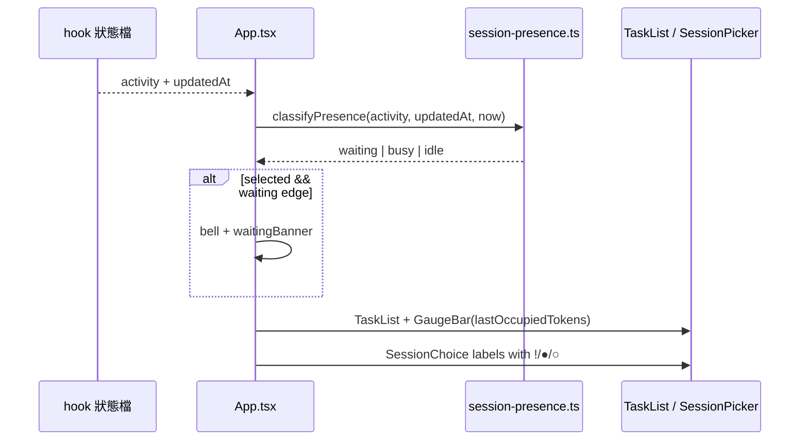

# v0.15 感知包 Design（P1 + P2 + P3）

日期：2026-09-16  
狀態：✅ 已實作完成（2026-09-16）  
對應 roadmap：`docs/superpowers/specs/2026-09-16-tui-feature-roadmap.md`  
基準：v0.14.1  

## 目標

讓 `task-tracker watch` 在**不開新面板**的前提下，立刻看出：

1. Claude **是否在等你**（P1）
2. 目前 session 的 **context 相對壓力**（P2，視覺血條）
3. 列表裡每個 session／專案的 **忙／等／閒**（P3）

## 非目標

- Timeline、卡住計時（P4／P5 → v0.16）
- 跨 session 鈴彙總、釘選、split（M*）
- 精確「距 context 上限還剩多少」的官方 API（我們只用既有 `lastOccupiedTokens` 代理）
- 可調設定 UI；閾值寫死
- 改 hook 行為或活動句文案（沿用 `describe-activity`）

## 現況可重用

| 既有 | 用途 |
|------|------|
| `activity.toolName` + `phase` | P1／P3 判定等待／忙碌 |
| `activity.at`、`updatedAt` | P3 閒置 |
| `lastOccupiedTokens` + `CONTEXT_WINDOW_TOKENS`（1e6） | P2 比例 |
| `formatOccupiedTokensLine` / TaskList 進度條樣式 | P2 UI |
| `withNotice` + `\x07` 響鈴 | P1 提示 |
| `SessionChoice.label` / `formatSessionLabel` | P3 色點前綴 |
| `isSessionBusy`（`phase === "running"`） | 與「忙碌」對齊，但等待要另分支 |

## 決策（寫死）

### P1 等待判定

```ts
function isWaitingForUser(activity: { toolName: string; phase: string } | undefined): boolean {
  if (!activity || activity.phase !== "running") return false;
  return activity.toolName === "AskUserQuestion" || activity.toolName === "ExitPlanMode";
}
```

- **不用**字串比對活動句（避免語系／文案微調誤判）。
- Banner 文案：
  - `AskUserQuestion` → `正在等待你的回答 — 回到 Claude Code 視窗`
  - `ExitPlanMode` → `正在等待你核准計畫 — 回到 Claude Code 視窗`
- 與既有 `notice`（新 session／advice）共用頂列：`waiting` **優先於**一般 notice 顯示；若同時有 waiting，仍只顯示 waiting banner（advice／新 session 的 notice 存在 state，等離開 waiting 後若仍有效可再顯示——實作採：waiting 期間不覆蓋掉 `notice` state，UI 層 waiting 蓋過 notice）。
- 響鈴：進入 waiting 邊沿響一次；同一段 waiting（同一 `toolName` + 連續 `phase===running`）不重響；離開後再進入可再響。用 ref 記 `lastWaitingKey: string | undefined`（例如 `${sessionId}:${toolName}:${activity.at}`）。
- 僅對**目前選中**的 session 做 P1 banner／鈴（跨 session 彙總是 M2）。

### P2 Context 血條

- 指標：`pct = round(lastOccupiedTokens / 1_000_000 * 100)`，與現有文字列同一來源。
- 無 `lastOccupiedTokens`：不畫 bar，保留「還沒有用量資料」。
- 有資料：在 `occupiedLine` **上方或同行**加 bar（寬度 24，重用 TaskList `ProgressBar` 視覺；可抽 `GaugeBar` 共用）。
- 文案維持「窗口約 …（約 n%）」；不改成「壓力」以免與現有 README／測試大改。若 pct ≥ 80 用黃色，≥ 95 用紅色，其餘綠色。
- **不**新增快捷鍵。

### P3 狀態色點

三態（優先序高→低）：

| 態 | 條件 | 符號 | 色 |
|----|------|------|-----|
| `waiting` | `isWaitingForUser(activity)` | `●` | yellow |
| `busy` | `phase === "running"` 且非 waiting | `●` | cyan |
| `idle` | 其餘，且 `now - updatedAt >= 60_000` **或** `phase === "done"`／無 running | `○` | gray |

補充：

- `phase === "done"` 但 `updatedAt` 在 60s 內 → 仍算 `idle`（剛做完，不是 busy）。
- `phase === "running"` 永遠不是 idle（即使 at 很舊——卡很久仍算 busy／waiting；卡住提示留給 P5）。
- **Session 列**：label 前加 `● `／`○ `（含顏色需 Ink；`ink-select-input` 的 label 是 string → **只能用 Unicode 符號區分，顏色做不到**）。決策：用前綴字元區分三態：
  - waiting: `! `
  - busy: `● `
  - idle: `○ `
- **專案列**：聚合該專案 sessions 的「最嚴重」態：`waiting > busy > idle`，同樣前綴。
- `SessionHint` 擴充可選欄位：`activityToolName?`、`activityPhase?`（或直接 `presence: SessionPresence`），由 `hintsFor` 填入；`formatSessionLabel`／`projectChoices` 吃 presence。

閒置閾值：**60_000 ms**（寫死）。

## 資料流



## 模組邊界

| 檔案 | 職責 |
|------|------|
| `src/session-presence.ts`（新） | `isWaitingForUser`、`classifyPresence`、`aggregatePresence`、banner 文案、label 前綴；純函式 |
| `src/session-presence.test.ts`（新） | 上列單元測試 |
| `src/context-snapshot.ts` | 可加 `formatContextGaugeBar(pct)` 或獨立 `src/ui/gauge-bar.ts` 純字串；測試 pct／色階字串 |
| `src/session-preference.ts` | hint／choice 串接 presence 前綴 |
| `src/ui/App.tsx` | waiting banner + 響鈴邊沿；hintsFor 帶 activity 欄位 |
| `src/ui/TaskList.tsx` | 顯示 gauge bar |
| README | 補一句：等待提示、血條、列表 `!`／`●`／`○` 意義 |

不改 hook、不改 schema（除非要持久化 presence——**不持久化**）。

## 測試清單

- [x] `isWaitingForUser`：AskUserQuestion／ExitPlanMode + running → true；done → false；Read+running → false
- [x] `classifyPresence`：三態與 60s 邊界
- [x] `aggregatePresence`：waiting 蓋 busy 蓋 idle
- [ ] label 前綴穩定
- [ ] gauge：undefined → 無 bar 字串；0%／50%／80%／95% 行為
- [x] （可選）小測試：waiting key 邊沿去重邏輯若抽成純函式

## 快捷鍵

無新增。

## 風險

- `ink-select-input` 無法著色單一 label → 靠符號；README 必須寫清楚。
- 專案列「有一個 waiting」會整列 `!`，可能顯得吵——符合「別漏掉等你」目標，接受。
- `lastOccupiedTokens` 是上一輪快照，非即時官方 window；文案已有「約」。

## 核准／完成

已核准並實作。Plan：`docs/superpowers/plans/2026-09-16-v0.15-presence.md`。
