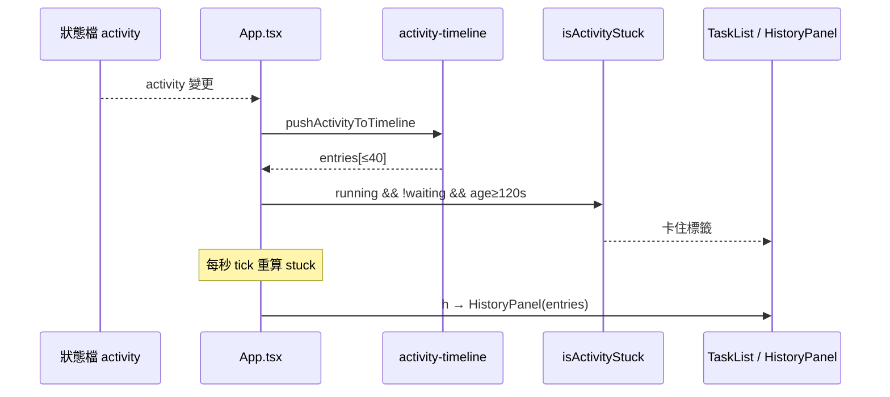

# v0.16 感知包 Design（P4 + P5）

日期：2026-09-16  
狀態：✅ 已實作完成（2026-09-16）
對應 roadmap：`docs/superpowers/specs/2026-09-16-tui-feature-roadmap.md`  
前置：v0.15 已在 `main`（P1–P3）  
基準：v0.14.1 + presence  

## 目標

1. **P4 活動 timeline**：最近 N 筆「正在／已…」活動句，按 `h` 開面板捲動查看。  
2. **P5 卡住計時**：非「等你」的 running 活動超過閾值時，標「可能卡住」。

## 非目標

- 落盤 timeline（重啟清空）
- 存 tool 全文／prompt／transcript
- 改 hook schema（不擴充狀態檔）
- 跨 session timeline（只跟目前選中的 session）
- 自動重試／殺 process 等動作

## 決策（寫死）

### P4 Timeline

| 項 | 決定 |
|----|------|
| 容量 `TIMELINE_MAX` | **40** |
| 儲存 | **僅 watch process 記憶體**；換 session 清空該 session 緩衝；離開 watch 全丟 |
| 快捷鍵 | **`h`** → `view === "history"`；`b`／Esc 回 main（與 advice／cache／tools 相同） |
| 條目內容 | `{ at, toolName, phase, summary?: string }` — 顯示用既有 `activityLineLabel` |
| 合併策略 | **Pre→Post 合併成一條**：若最新一筆是同 `toolName` 且 `phase==="running"`，新活動為 `done` 時**覆寫**該筆為 done；否則 append。同一 `at`+`phase` 重複 change 事件略過（chokidar 去重） |
| 來源 | `App` 盯選中 session 的 `taskState.activity` 變化時呼叫純函式 `pushActivityToTimeline` |
| UI | 新 `HistoryPanel.tsx`（仿 `AdvicePanel`：標題、↑↓／j k 捲動、底部鍵位說明） |

純函式（新檔 `src/activity-timeline.ts`）：

```ts
export const TIMELINE_MAX = 40;

export interface TimelineEntry {
  at: string;
  toolName: string;
  phase: "running" | "done";
  summary?: string;
}

export function pushActivityToTimeline(
  prev: TimelineEntry[],
  activity: TimelineEntry | undefined,
  max?: number,
): TimelineEntry[];
```

### P5 卡住計時

| 項 | 決定 |
|----|------|
| 閾值 `STUCK_MS` | **120_000**（120 秒） |
| 判定 | `phase === "running"` 且 **非** `isWaitingForUser(activity)` 且 `now - Date.parse(activity.at) >= STUCK_MS` |
| 顯示 | 主畫面活動列旁／下方一行黃色：`可能卡住（已 Nm）`（≥60s 用分鐘，否則秒）；**不**搶 P1 waiting banner |
| 重繪 | `App` 在選中 session 且 activity running 時設 `setInterval(1000)` bump revision，離開 running 清掉 |
| 等待態 | 明確排除（P1 已處理）；不算卡住 |

純函式（可放 `src/session-presence.ts` 或 `src/activity-stuck.ts`）：

```ts
export const STUCK_MS = 120_000;

export function isActivityStuck(input: {
  activity?: { toolName: string; phase: string; at: string } | null;
  now?: number;
}): boolean;

export function formatStuckLabel(activityAt: string, now?: number): string;
// e.g. "可能卡住（已 2m）" / "可能卡住（已 45s）"
```

## 資料流



## 模組邊界

| 檔案 | 職責 |
|------|------|
| `src/activity-timeline.ts` + test | push／trim／合併 |
| `src/activity-stuck.ts` + test（或併入 session-presence） | stuck 判定與文案 |
| `src/delete-session.ts` | `WatchView` 加 `"history"` |
| `src/ui/HistoryPanel.tsx` | timeline 列表 UI |
| `src/ui/App.tsx` | 緩衝 state、`h` 鍵、interval、傳 stuck 給 TaskList |
| `src/ui/TaskList.tsx` | 顯示 stuck 標籤；footer 加「按 h 活動紀錄」 |
| `README.md` | `h`、卡住提示、timeline 僅記憶體 |

## 測試清單

- [x] push：running append；同 tool done 覆寫；不同 tool append；超過 40 trim
- [x] 同 at+phase 不重複 append
- [x] stuck：running+Read+121s → true；119s → false；AskUserQuestion running → false；done → false
- [x] formatStuckLabel 分秒／分
- [x] `shouldHandleDeleteKey` 等既有 view 測試若列舉 WatchView 需含 history（刪除鍵仍僅 main）

## 風險

- chokidar 連續 change 可能同一 activity 觸發多次 → 靠 at+phase 去重
- 只看目前選中 session；切走再切回 timeline 空（可接受，符合記憶體策略）
- interval 每秒重繪：僅 running 時啟用，成本可接受

## 核准／完成

已核准並實作。Plan：`docs/superpowers/plans/2026-09-16-v0.16-timeline-stuck.md`。
