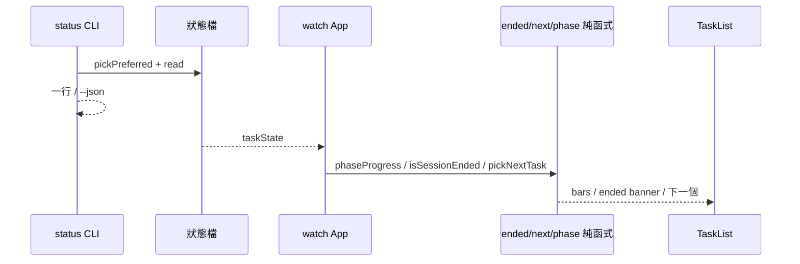

# v0.17 Design — E1 status + T1 phase 條 + T2 結束摘要 + T4 下一個該做

日期：2026-09-16  
狀態：已核准  
對應 roadmap：整合後 **v0.17**（`docs/superpowers/specs/2026-09-16-tui-feature-roadmap.md`）  
前置：P1–P5 已在 main  

## 目標

同一 release 交付四件「進度／狀態」能力：

1. **E1** `task-tracker status` — 一行摘要給 tmux／腳本  
2. **T1** workflow phase 進度條（主畫面）  
3. **T2** session 結束摘要（判定 + 主畫面提示；可選落盤）  
4. **T4** 「下一個該做」一句（pending、不依賴 T3）

## 非目標

- T3 依賴圖、M*、C*、E2–E4  
- bump version（非切 release 時）  
- 改 hook／寫入 Claude transcript  
- 精確偵測 Claude process 存活（無可靠 PID 契約時不強求）

---

## E1 `task-tracker status`

### 行為

```bash
task-tracker status              # cwd 對應偏好 session；無則空狀態
task-tracker status --session <id>
task-tracker status --json       # 機器可讀
```

- **不**啟動 Ink；exit 0（含「沒有 session」）  
- 資料：`listSessionIds` + `readTaskState` + `pickPreferredSession`（與 watch 同一套偏好）  
- 可選讀 `peek`／不強制 transcript（v0.17 先不做 token；有 activity／tasks 即可）

### 輸出（寫死）

**純文字一行**（預設）：

```text
idle · s/e9efe088 · ○ 3/5 · 正在讀取 src/schema.ts
```

欄位：`presence`（waiting|busy|idle，重用 `classifyPresence`）· 短 id · 任務完成數／總數（無 task／todo 則省略 `○ k/n`）· 活動句截斷（有則附上）

無 session：

```text
none
```

**`--json`**：單一物件，例如  
`{ "sessionId", "presence", "done", "total", "activitySummary", "cwd" }`；無 session 時 `{ "sessionId": null }`。

### 模組

- `src/commands/status.ts` + test  
- `cli.tsx` 註冊 `status`

---

## T1 Phase 進度條

### 行為

當 `state.workflow` 存在且 `phases.length > 0`：

- 計算 `done = phases.filter(p => p.status === "completed").length`，`total = phases.length`  
- 在 TaskList **既有 task 進度條上方**（或緊鄰 workflow 區）顯示一行：與現有 `ProgressBar` 同視覺，標籤前綴 `phases` 或文案 `Phase █… k/n`  
- **巢狀 `▸`**：沿用現有 `liveWorkflow`／journal 規則——列上已是展開後的父 phase 列表；進度條只數 `state.workflow.phases` 陣列長度（與列一致）  
- 無 workflow：不顯示

### 模組

- 純函式 `phaseProgress(run): { done, total } | undefined`（可放 `src/workflow/phase-progress.ts`）  
- `TaskList.tsx` 渲染

---

## T2 Session 結束摘要

### 「結束」操作型定義（寫死）

同時滿足：

1. `activity` 不存在 **或** `activity.phase === "done"`  
2. `now - Date.parse(updatedAt) >= ENDED_MS`（**300_000** = 5 分鐘）  
3. 沒有 `in_progress` 的 task／todo／workflow phase  

→ `isSessionEnded(state, now) === true`

不掃 OS process；不寫 Claude 檔。

### 顯示

- 主畫面頂部（notice 級、低於 waiting banner）：  
  `Session 似乎已結束 · 任務 k/n · 最後：…`  
- 無 task／todo：`任務 —`；最後活動用 `activityLineLabel` 或「無活動」  
- 離開 ended 條件（又出現 running）→ 提示消失  

### 落盤（寫死）

- **v0.17 不落盤摘要檔**（只記憶體／當下畫面）  
- `d`／`clear` 行為不變；不新增摘要 JSON  

### 模組

- `src/session-ended.ts`：`ENDED_MS`、`isSessionEnded`、`formatEndedSummary`  
- `App.tsx`／`TaskList` 接線（可每 30s 或沿用 stuck 的 clock 在選中時重算）

---

## T4 「下一個該做」

### 規則（寫死）

從 `state.tasks` 與 `state.todos` 收集候選：

1. status === `pending`  
2. 若有 `blockedBy` 且長度 > 0 → 跳過（無欄位視同未 blocked）  
3. 排序：tasks 依 id 字串；todos 依陣列順序；**tasks 整組排在 todos 前**  
4. 取第一個 → 文案：`下一個：{label}`（label 同 taskRows 規則：subject／content）  

無候選：不顯示。有 `in_progress` 時仍可顯示下一個 pending（並行資訊）。

### 模組

- `src/next-task.ts`：`pickNextTask(state): { label } | undefined`  
- `TaskList` 活動列下方一行 dim／cyan

---

## 資料流（摘要）



## 測試清單

- [ ] status：無 session → `none` exit 0；有 session 含 presence／任務數  
- [ ] status `--json` 欄位穩定  
- [ ] phaseProgress：無 workflow → undefined；3 phase 2 completed → 2/3  
- [ ] isSessionEnded：邊界 5 分鐘；running activity → false；in_progress task → false  
- [ ] pickNextTask：跳過 blockedBy；tasks 優先於 todos；無 pending → undefined  

## 風險

- 「5 分鐘無更新」可能誤判長考／使用者離開又回來——接受；文案用「似乎已結束」  
- status 與 watch presence 必須共用 `classifyPresence`，避免兩套定義  

## 核准

請回覆「核准」或要改的決策（尤其：結束閾值 5 分鐘、status 一行格式、T2 不落盤）。  
核准後：plan → TDD 實作。
