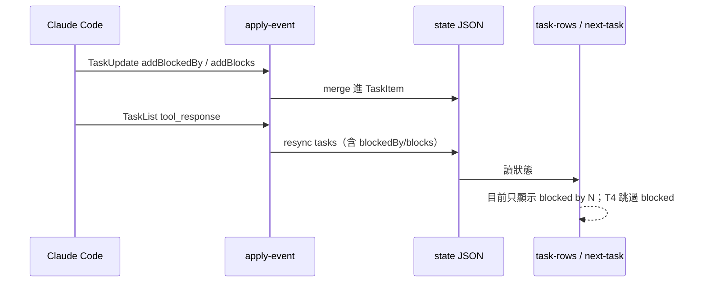

# T3 Task 依賴圖 — 研究筆記

日期：2026-09-17  
狀態：研究完成 · **暫緩實作**（2026-09-17 決策：先留本文件，不做 T3）  
對應 roadmap：`docs/superpowers/specs/2026-09-16-tui-feature-roadmap.md` §T3  

## 問題

1. `blockedBy`／`blocks` 在本專案資料流是否完整？  
2. 欄位是推測還是有一級來源？本機狀態檔有沒有真實依賴？  
3. T3（文字依賴圖）現在值不值得做？

## 結論

**技術上可以做，且欄位名稱已有一級文件背書；但本機目前沒有任何可觀測的依賴資料，產品價值偏低，建議暫緩或縮成「有邊才縮排／標 subject」的小改。**

理由摘要：

- Hook／schema／T4 已接好依賴欄位；缺的是 UI 拓撲與環處理。  
- 官方 Agent SDK「Track todos」表已寫明 `TaskUpdate` 含 `addBlocks?`／`addBlockedBy?`（不再只是 README 所稱的猜測）。  
- 本機 `~/.claude-task-tracker`：**28** 個狀態檔、**0** 個含 `tasks`、**0** 個含非空依賴；`hook-debug.log` 無 `TaskCreate`／`TaskUpdate`／`blockedBy` 紀錄。  
- 新模型預設常關掉 Task 工具（需 `CLAUDE_CODE_ENABLE_TODO_TOOLS=1` 等），依賴圖在「沒開工具」的 session 永遠空白。

---

## 證據

### 1. 本 repo 資料流（完整）

| 階段 | 行為 | Source |
|------|------|--------|
| Schema | `TaskItem.blockedBy`／`blocks`；`TaskUpdateInput.addBlockedBy`／`addBlocks` | `src/schema.ts` |
| Hook `TaskUpdate` | `mergeIdLists(previous, input.add*)` 寫入狀態檔 | `src/hook/apply-event.ts` |
| Hook `TaskList` | `extractTaskList` → `TaskItemSchema.safeParse`（含依賴欄位）整包 resync | 同上 |
| T4 | `pickNextTask` 跳過 `blockedBy.length > 0` | `src/next-task.ts` |
| UI | 僅 suffix `blocked by N`，不畫圖、不顯示 id／subject | `src/ui/task-rows.ts` |

### 2. 一級來源 vs 推測

| Claim | 判定 | Source |
|-------|------|--------|
| Hooks 文件記載 `TaskCreated`／`TaskCompleted` 事件欄位 | ✅ 一級 | https://docs.claude.com/en/docs/claude-code/hooks |
| Hooks 文件給完整 `TaskUpdate` tool_input schema | ❌ 無 | 同上（僅事件，無 addBlocks 細節） |
| Agent SDK「Track todos」對照表：`TaskUpdate` input 含 `addBlocks?`／`addBlockedBy?` | ✅ 一級 | https://code.claude.com/docs/en/agent-sdk/todo-tracking |
| Tools reference：`TaskUpdate`「Updates task status, **dependencies**, details…」 | ✅ 一級（語意） | https://code.claude.com/docs/en/tools |
| Agent teams：任務可有依賴；完成 blocker 會自動 unblock | ✅ 一級（產品語意） | https://code.claude.com/docs/en/agent-teams |
| README 仍寫「欄位是推測值」 | ⚠️ 過時 | `README.md`「重要注意事項」 |
| Claude Code 內部 `TaskUpdateTool` inputSchema 含同名字段 | 二級／非官方鏡像 | 僅作交叉驗證，不當唯一依據 |

**更新判斷**：相對於寫 roadmap／README 時，「欄位名對不對」風險已明顯下降；剩餘風險是 **TaskList 回傳形狀**、**完成後 blockedBy 是否被上游過濾**、以及 **模型是否真的會設依賴**。

### 3. 本機實證（2026-09-17）

| 指標 | 值 |
|------|-----|
| 狀態檔 `~/.claude-task-tracker/*.json` | 28 |
| 含非空 `tasks` | 0 |
| 含非空 `todos` | 0 |
| 任一 task 非空 `blockedBy`／`blocks` | 0 |
| `hook-debug.log` 含 Task*／blocked* | 無匹配 |

樣本狀態檔鍵：`sessionId, cwd, claudeSessionDir, updatedAt, activity`（只有活動句，無任務清單）。

→ 在這台機器上，T3 即使上線也幾乎永遠走「無依賴 → 平鋪」路徑；無法用真實 session 做端到端驗收，只能靠單元測試 fixture。

### 4. T3 roadmap 驗收 vs 現況

Roadmap 驗收（`2026-09-16-tui-feature-roadmap.md`）：

- 有依賴時可讀；無依賴時與現況相同  
- schema 不匹配 → debug log + 平鋪  
- 單元測試覆蓋拓撲／環  

| 驗收項 | 可否測 | 缺什麼 |
|--------|--------|--------|
| 無依賴平鋪 | ✅ 已有現況 | — |
| 有邊縮排／`A → B` | ✅ 可用 fixture | 本機無真實樣本校準文案 |
| 環 → 標循環並平鋪 | ✅ 純函式可測 | 需新模組 |
| Hook 不炸 | ✅ 既有 safeParse／略過 | — |
| 真實 Claude 端到端 | ❌ 本機缺 Task 工具使用 | 需開 `CLAUDE_CODE_ENABLE_TODO_TOOLS=1` 並讓模型設依賴（或 agent teams）後抓一份狀態檔 |

### 5. 產品／環境限制

- 新模型常不帶 Task 工具；README 已要求 `CLAUDE_CODE_ENABLE_TODO_TOOLS=1`（見 README「重要注意事項」與 https://code.claude.com/docs/en/tools ）。  
- 依賴較常出現在 **agent teams／多人協調**（官方 agent-teams 文件），單人短 session 可能很少設 `addBlockedBy`。  
- `TodoWrite` 路徑**沒有**依賴欄位；T3 只服務 Task* 狀態。

---

## 風險

1. **空白 UI 常態**：多數使用者看不到圖 → 感覺像沒做。  
2. **雙向邊**：上游維護雙向；只渲染一邊即可，若只收到半邊要能降級。  
3. **TaskList 可能過濾已完成 blocker**（二級說法）：應用「當下狀態」而非重建完整歷史 DAG。  
4. **README 過時**：仍稱推測，易誤導後續設計。

---

## 建議下一步

| 選項 | 建議 |
|------|------|
| **A. 暫緩 T3**（推薦） | 等至少一份含非空 `blockedBy`／`blocks` 的狀態檔再做。 |
| **B. 縮小範圍** | 不做完整圖：有 `blockedBy` 時 suffix 改成 subject（或短 id）；fixture 測。半日級。 |
| **C. 完整 T3** | 純函式拓撲 + 環偵測 + 縮排；TDD fixture。可做，短期使用者感知弱。 |

**決策（2026-09-17）**：選 **A 暫緩**。本文件保留；未核准前不寫 T3 plan、不動依賴圖 code。

**推薦：A，或先做 B。** 若選 C，先更新 README「推測」段落，改引 Agent SDK todo-tracking。

開工前請明確點名 A／B／C；未核准前不寫 plan、不動 code。
