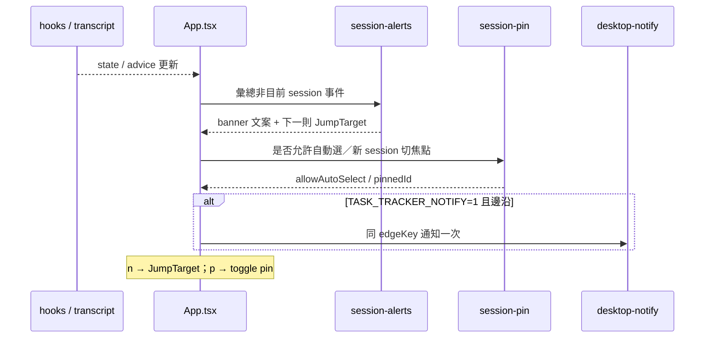

# v0.19 Design — 多 session 監控（M1 + M2 + M3 + E2）

日期：2026-09-17  
狀態：已核准  
對應 roadmap：`docs/superpowers/specs/2026-09-16-tui-feature-roadmap.md` v0.19  
基準：v0.18.0（+ PR #25 狀態／熱力 bugfix 若已合入）  
前置：P1–P5、E1、T1／T2／T4、C2–C4  

## 目標

同一 release 交付四件「多 session 監控」能力（不含 split）：

1. **M1** Picker 資訊密度 — 活動截斷與缺資料降級更穩（不加用量縮略）  
2. **M2** 跨 session 鈴彙總 — 頂列顯示誰在等你／誰有新 advice；`n` 依種類跳轉  
3. **M3** 釘選 session — `p` 切換；僅本次 `watch` 行程；釘住時新 session 不自動切焦點  
4. **E2** 桌面通知（可選）— `TASK_TRACKER_NOTIFY=1` 時對 M2 同事件發 OS 通知  

## 非目標

- M4 雙欄 split  
- 釘選落盤／跨 watch 行程持久化  
- Picker 用量％／迷你血條（M1 刻意不做）  
- 改 hook schema、bump version（非切 release）  
- 對「目前正在看的 session」再洗一輪桌面通知（與 M2 同：只通知**非目前** session）  
- 新獨立「警報中心」面板  

## 架構取捨

採 **純函式模組 + App 接線**（與 `session-presence` 同風格），不把邏輯全塞進 `App.tsx`，也不另開警報面板。

---

## 鎖定決策

| 項 | 值 |
|----|-----|
| M2 跳轉 | **依種類**：waiting → 切該 session 主畫面；advice → 選該 session 並開 `a` |
| M2 鍵 | **`n`**（無待跳事件則 no-op） |
| M3 鍵 | **`p`** 切換釘選／解除 |
| M3 儲存 | **僅 watch process 記憶體**；重開解除 |
| M1 | **只截斷／降級**；不加用量縮略 |
| E2 範圍 | 與 M2 **同一批非目前 session** 事件 |
| E2 開關 | `TASK_TRACKER_NOTIFY=1`（或 truthy）；預設關 |
| 去重 | 同一 `(sessionId, kind, edgeKey)` 終端鈴與桌面通知各最多一次，直到解除或換成下一則 |

---

## M1 Picker 資訊密度

### 行為

- 沿用既有 label 組裝（短 id、title／firstPrompt、activitySummary、相對時間、presence 前綴／上色）  
- **統一截斷**：各片段與整列在窄終端不換行爆版（既有 `clipLabelPart`／Ink 寬度行為收斂成明確常數與測試）  
- **缺資料降級**：無 activity／無 title 時不留空洞標點；無 cwd 已進「未知專案」（#25）  
- **不做**：列上 `42%`、迷你血條、額外 token 欄  

### 模組

- `session-preference.ts`（truncate 常數／helper + 測試）  
- 必要時微調 `SessionPicker`／label 組裝，不新增面板  

### 驗收

- [ ] 極窄寬度下列可讀、不炸版  
- [ ] 缺 activity／title 時標籤仍合法  
- [ ] 與 P3 色點／前綴並存  

---

## M2 跨 session 鈴彙總

### 事件種類

| kind | 條件 | `n` 行為 |
|------|------|----------|
| `waiting` | 非目前 session，`isWaitingForUser(activity)` | 切到該 `sessionId`，`view=main` |
| `advice` | 非目前 session，有**尚未確認過的**新 advice 邊沿 | 切到該 `sessionId`，`view=advice` |

優先序（寫死）：**waiting > advice**；同 kind 取較新 `at`／edge。

### 頂列 UI

- 有待處理跨 session 事件時，頂部 notice／banner 顯示一行彙總，例如：  
  `⚠ 2 個 session 在等你 · 按 n 跳轉` 或  
  `用量建議 · e9efe088 · 按 n 查看`  
- 與目前 session 的 P1 waiting banner **並存規則**：目前 session 正在等你時，P1 文案優先；跨 session 摘要可併成次行或附在 notice（實作選「P1 優先、M2 次之」單行合併若寬度不足則只留 P1 + `n` 提示）  
- 終端響鈴：僅在**新邊沿**（與既有 `shouldRingWaitingBell` 精神一致）對非目前 session 響一次；與目前 session P1 鈴不互相取消  

### 模組

- `src/session-alerts.ts` + test：  
  - `collectAlertEvents(hints | states, adviceBySession, selectedSessionId, now)`  
  - `formatAlertBanner(events)`  
  - `nextJumpTarget(events): { sessionId, kind: "waiting" | "advice" } | undefined`  
  - `alertEdgeKey(event)` 供去重  

### App 接線

- `useInput`：`n` → `nextJumpTarget` → `setSelectedSessionId` + 必要時 `setView("advice")`；並 `setBrowsing(false)`  
- 維護 `lastAlertEdgeKey` ref，與鈴／E2 共用  

### 驗收

- [ ] 非目前 session 的 waiting／advice 出現在彙總  
- [ ] `n` 行為符合上表  
- [ ] 同 edge 不瘋狂響鈴  

---

## M3 釘選 session

### 行為

- 狀態：`pinned: boolean`（記憶體）。對象就是當下的 `selectedSessionId`（不另存 pin id）。  
- `p`：僅在 `view === "main"` 且已選中某 session 時切換 `pinned`。  
- 標題／副標可見「已釘選」（`pinned === true`）。  
- **`pinned === true` 時**：  
  - 新 session 出現 → 只 notice，**不**改 `selectedSessionId`  
  - 跳過 `shouldAutoSelectSession`／自動選路徑  
- **使用者手動操作**：  
  - `b` 回列表 → `pinned = false`，並清選中（既有 leave 行為）  
  - 從列表選另一個 session → 進入後若先前為 pinned，維持 `pinned = true`（鎖的是「不要被自動拖走」，不是鎖死舊 id）  
- 重開 `watch` → pin 消失  

### 模組

- `src/session-pin.ts` + test：`shouldBlockAutoSelect(pinned)`、`shouldBlockNewSessionFocus(pinned)`、標題後綴 helper  

### 驗收

- [ ] 釘選態可見  
- [ ] 釘住時新 session 不切焦點  
- [ ] `b` 解除 pin；README 說明與上列一致  

---

## E2 桌面通知（可選）

### 行為

- 僅當 `process.env.TASK_TRACKER_NOTIFY` 為 truthy（`1`／`true`／`yes`）  
- 事件與 M2 相同（非目前 session 的 waiting／advice 邊沿）  
- 與終端 `\x07` **共用 edgeKey**：同一邊沿可兩者都發一次，但不因重繪重發  
- 實作：macOS `osascript` display notification best-effort；其他平台先 no-op 或同等 best-effort；**任何失敗静默**  
- 標題／內文短：專案名或短 id + 「正在等你」／「有新的用量建議」  

### 模組

- `src/desktop-notify.ts` + test（mock spawn；不真的彈系統通知）  

### 驗收

- [ ] 預設關閉  
- [ ] 失敗不影響 TUI  
- [ ] 同 edge 不洗版  

---

## 測試計畫

- `session-alerts`：優先序、跳轉目標、banner、edge 去重  
- `session-pin`：釘住阻擋 auto-select／新 session focus；`b` 清 pin  
- `desktop-notify`：env 門閘、edge 去重、spawn 失敗静默  
- `session-preference`：M1 truncate／缺欄降級  
- App 層：能測的接線以純函式為主；必要時輕量 input 模擬  

## 文件

- README：`n`／`p`、釘選語意、`TASK_TRACKER_NOTIFY`  
- roadmap：v0.19 標實作中／完成時勾驗收  

## 實作順序（建議）

1. M3 pin 純函式 + App `p`／阻擋自動切  
2. M2 alerts 純函式 + 頂列 + `n` + 鈴去重  
3. E2 notify 接同一 edge  
4. M1 truncate 收斂  
5. README + roadmap  

（可與已開分支 `gogogohuang/v0.19-multi-session`／PR #25 bugfix 同線或 rebase 後繼續。）
