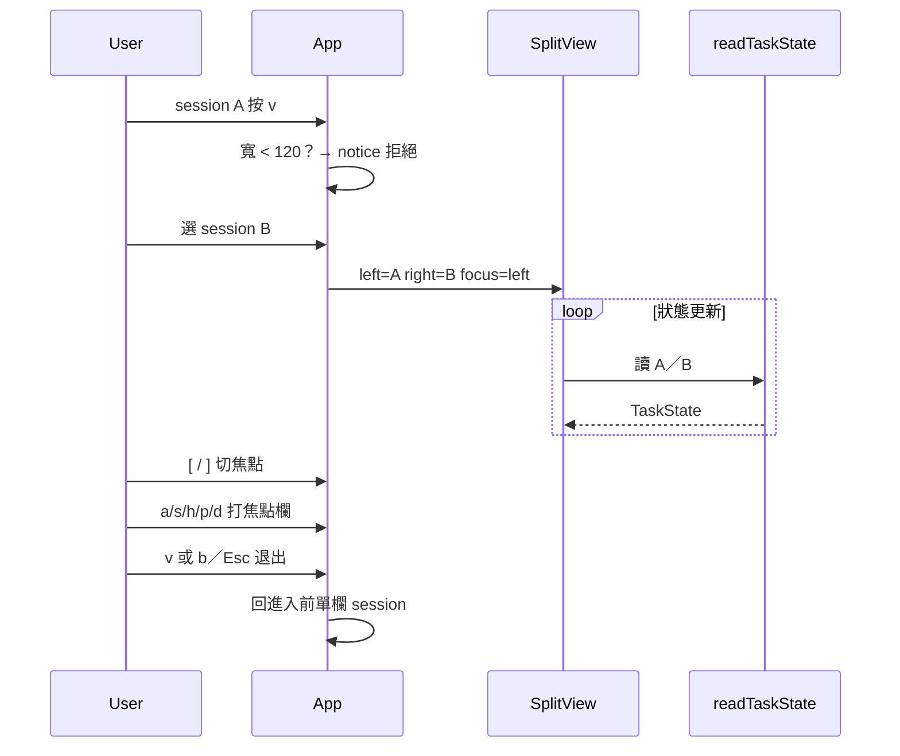

# v0.20 Design — M4 雙欄 split

日期：2026-09-17  
狀態：已核准  
對應 roadmap：`docs/superpowers/specs/2026-09-16-tui-feature-roadmap.md` v0.20  
基準：v0.19.0  
前置：M1–M3、E2、P1–P5  

## 目標

在 `task-tracker watch` 同時監看**兩個** session：各欄顯示活動句、context 血條、精簡可捲 task 列表（最多 5 行）；左右獨立更新。

## 非目標

- 完整對話／transcript 並排  
- 三欄以上  
- 落盤 split 配置（重開 watch 不記得左右 session）  
- 窄終端強制擠進 split  
- bump version（非切 release）  
- 改 hook schema  

## 架構取捨

採 **精簡 `SplitPane` ×2 + App `view === "split"`**，不並排完整 `TaskList`。

---

## 鎖定決策

| 項 | 值 |
|----|-----|
| 進入 | 已選 session A、`view===main` 按 **`v`** → 進入「選第二 session」列表 → 選 B |
| 最小寬 | **`process.stdout.columns < 120`** → 不進 split，notice 說明 |
| 每欄內容 | 短 id、presence 色／前綴、活動句、血條、task 列 **最多 N=5**（可捲） |
| 焦點 | **`[`** 左、**`]`** 右；焦點欄標題有標示（例如 `▸`） |
| 退出 | **`v` 或 `b`／Esc`** → 退出 split，回到進入前的單欄 session（A） |
| 快捷鍵 | `a`／`s`／`h`／`p`／`d` **只作用焦點欄**對應 session |
| 全域 | `n`、跨 session 彙總／鈴／E2、`q` 仍全域 |
| 第二 session 來源 | 與現有專案／session picker 相同資料；不可選與 A 相同 id |

---

## 進入／退出流程

### 進入

1. 使用者在單欄 main、已 `selectedSessionId === A`  
2. 按 `v`：  
   - 若 `columns < 120` → `setNotice("終端寬度不足（需 ≥ 120）無法分割")`，停留單欄  
   - 否則進入選 B 模式（可重用專案→session 列表，或扁平 session 列表；寫死：**沿用現有專案／session picker 流程**，選中後設 `splitRightId`）  
3. 選 B 後：`view = "split"`，`splitLeftId = A`，`splitRightId = B`，`splitFocus = "left"`，記住 `splitReturnSessionId = A`  

### 退出

- `v` 或 `b`／Esc（在 split 內）：`view = "main"`，`selectedSessionId = splitReturnSessionId`，清 split 狀態  
- 不經列表中轉  

### 選 B 時按 `b`

- 取消進 split，回到 A 單欄（與「退出選第二支」一致）  

---

## UI：`SplitView`

每欄（`SplitPane`）：

| 區 | 內容 |
|----|------|
| 標題 | `▸`（焦點）或空白 + 短 id + presence 色 + 可選「已釘選」（僅當焦點欄且 pin 且 pin 對象為該欄 session） |
| 活動 | `activityLineLabel` 一截 |
| 血條 | 既有 `formatContextGaugeBar`（該 session `peek`） |
| Tasks | 最多 5 可見列；`j`／`k`／↑↓ **僅焦點欄**捲動 |

兩欄水平並排（Ink `Box` flexDirection row）；中間可選一窄分隔。

---

## App 接線

- 擴充 `WatchView`：`"split"`（或等價）  
- state：`splitLeftId`、`splitRightId`、`splitFocus: "left" | "right"`、`splitReturnSessionId`  
- watcher：既有 STATE_DIR／選中檔案邏輯改為**同時刷新左右**（或 split 時 watch 兩個 id）  
- `p` 釘選：作用於焦點欄 session；語意與 v0.19 相同（阻擋自動切焦點），split 內不另發明 pin  
- 寬度變窄（resize &lt; 120）：**不強制踢出**（進門檻只在進入時檢查）；可選 notice「建議加寬」（非必須，v0.20 可不做）  

---

## 模組

| 檔 | 職責 |
|----|------|
| `src/split-layout.ts` | `MIN_SPLIT_COLUMNS = 120`、`SPLIT_TASK_ROWS = 5`、`canEnterSplit(columns)`、`otherFocus(focus)` |
| `src/ui/SplitView.tsx` | 雙欄排版 |
| `src/ui/SplitPane.tsx`（可併入 SplitView） | 單欄精簡內容 |
| `App.tsx` | `v` 進入／退出、選 B、`[` `]`、焦點快捷鍵路由 |
| `delete-session.ts` | `WatchView` 含 `split` 時 `d`／`shouldHandleDeleteKey` 規則 |

---

## 測試

- `split-layout`：寬度門檻、焦點切換 helper  
- SplitPane／label：N=5 截斷行為（純函式優先）  
- App 層：以純函式為主；必要時輕量測「不可選同一 id」  

## 文件

- README：`v` 進出 split、`[` `]`、寬度 120、每欄內容  
- roadmap：v0.20 標實作中／完成  

## 實作順序（建議）

1. `split-layout` + 測試  
2. `SplitPane`／`SplitView` 靜態渲染  
3. App：進入／選 B／退出／焦點  
4. watcher 雙 session + 快捷鍵路由  
5. README + roadmap  

## 驗收對照（roadmap）

- [ ] 兩欄獨立更新  
- [ ] `[`／`]` 選焦點、`v`／`b` 退出  
- [ ] 寬 &lt; 120 不可進  
- [ ] 不做完整對話並排  
