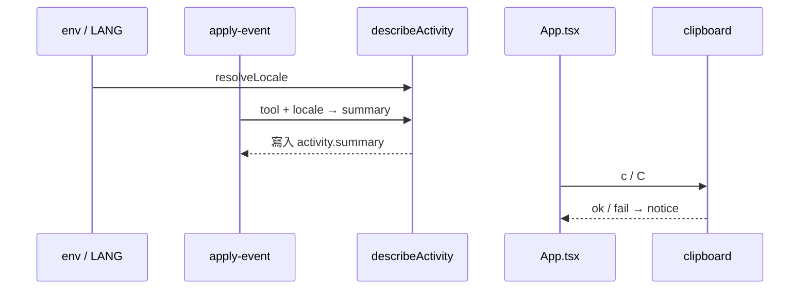

# v0.21 Design — E3 活動句語系 + E4 複製快捷鍵

日期：2026-09-17  
狀態：已核准  
對應 roadmap：`docs/superpowers/specs/2026-09-16-tui-feature-roadmap.md` v0.21  
基準：v0.20.0  
前置：P／T／C／M／E1–E2  

## 目標

1. **E3**：活動句支援 en／zh；`TASK_TRACKER_LOCALE` 優先，否則從 `LANG` 推斷；未知回退 **zh**。hook 寫入與 TUI 顯示同源。  
2. **E4**：主畫面／split 焦點欄：`c` 複製 session id、`C` 複製暫存 JSON path。  

## 非目標

- **T3** Task 依賴圖（本版跳過／暫緩）  
- 可調設定 UI、完整 i18n 框架  
- 複製 transcript／advice 全文  
- bump version（非切 release）  
- 改 TaskState schema 結構（不新增 locale 欄位；summary 字串依當下 locale 寫入）  

## 架構取捨

純函式 `resolveLocale` + `describeActivity` 吃 locale；clipboard 獨立模組（可 mock）。App 只接鍵位與 notice。



---

## 鎖定決策

| 項 | 值 |
|----|-----|
| 範圍 | **E3 + E4**；T3 不做 |
| Locale | `TASK_TRACKER_LOCALE=en\|zh` 優先；否則 `LANG` 以 `en` 開頭（不分大小寫）→ en；其餘 → **zh** |
| 未翻工具 | en：`Using {tool}`／`Used {tool}`；zh：維持現有「正在／已使用」 |
| E4 鍵 | **`c`** = session id；**`C`** = `statePathForSession(id)` |
| E4 作用域 | `view === "main" \|\| "split"`；split 用焦點欄 session |
| Clipboard | macOS `pbcopy` best-effort；其他平台可試 `xclip`／no-op；失敗 notice、不崩潰 |

---

## E3 活動句語系

### `resolveLocale(env): "zh" | "en"`

```text
若 TASK_TRACKER_LOCALE trim 後為 en|zh（大小寫不敏感）→ 該值
否則若 LANG（或 LC_ALL）以 en 開頭 → en
否則 → zh
```

### `describeActivity`

- 簽名增加可選 `locale?: "zh" | "en"`（預設呼叫端傳 `resolveLocale(process.env)`）  
- 既有 zh 文案保留；en 平行模板覆蓋主要工具（Read／Edit／Write／Bash／Glob／Grep／AskUserQuestion／ExitPlanMode／TodoWrite／Task*／Agent／Workflow 等與現表同級）  
- 測試：同一 input 在 zh／en 下輸出不同且穩定  

### Hook

- `apply-event`／`describeActivity` 呼叫處傳入 `resolveLocale(process.env)`  
- 已寫入狀態檔的舊 summary **不回填翻譯**（只影響新事件）  

### TUI

- 顯示 activity 時若只用已存 summary 字串，則隨 hook 語系；`activityLineLabel` 若重組句子也要吃同一 locale（檢查 `context-snapshot`）  

---

## E4 複製快捷鍵

### 行為

| 鍵 | 複製內容 | 成功 notice（例） |
|----|----------|-------------------|
| `c` | `sessionId` 全文 | `已複製 session id` |
| `C` | `join(STATE_DIR, id + ".json")` 絕對／既有 `statePathForSession` | `已複製暫存路徑` |

- 無作用中 session → no-op 或 notice「沒有可複製的 session」  
- clipboard 失敗 → `複製失敗（請手動選取）`  

### 模組

- `src/clipboard.ts`：`copyText(text, deps?)`；deps mock spawn  
- `src/locale.ts`：`resolveLocale`  
- `describe-activity.ts`：雙語  
- `App.tsx`：`c`／`C`  

---

## 測試

- `resolveLocale`：env／LANG／fallback  
- `describeActivity`：代表性工具 zh／en  
- `copyText`：成功／spawn 失敗  
- 既有 describe／apply 測試改為顯式傳 `zh` 以免 LANG 污染  

## 文件

- README：`TASK_TRACKER_LOCALE`、`c`／`C`  
- roadmap：T3 標暫緩；E3／E4 完成後勾選  

## 實作順序

1. `locale` + 測試  
2. `describeActivity` en 模板 + 測試（既有測鎖 zh）  
3. hook 接 `resolveLocale`  
4. `clipboard` + App `c`／`C`  
5. README + roadmap  

## 驗收對照

- [ ] en／zh 覆蓋主要工具句  
- [ ] 未知 locale → zh  
- [ ] hook 與描述同源  
- [ ] `c`／`C` 有說明；失敗有 notice；不與既有鍵衝突  
